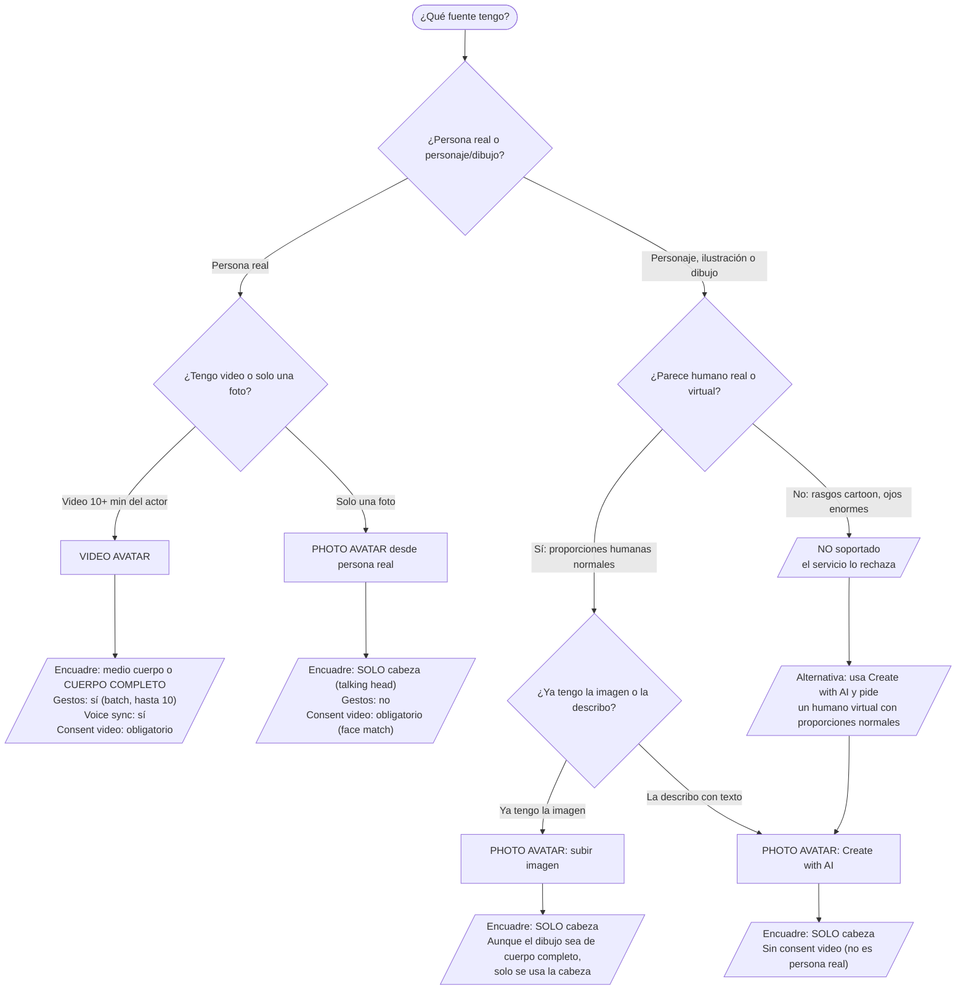
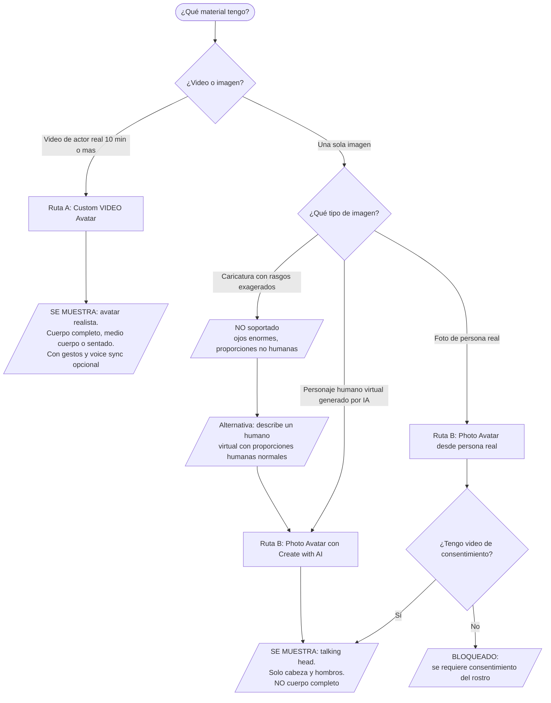
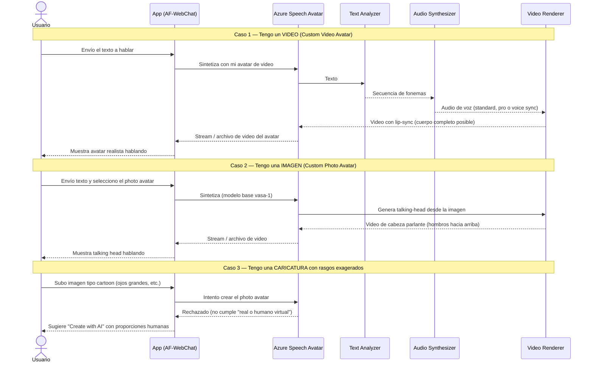

# 🎭 Guía: Custom Avatar de Azure AI Speech (Text to Speech Avatar)

> **Fuentes oficiales de Microsoft:**
> [¿Qué es el custom text to speech avatar?](https://learn.microsoft.com/azure/ai-services/speech-service/text-to-speech-avatar/what-is-custom-text-to-speech-avatar) ·
> [Crear custom **video** avatar](https://learn.microsoft.com/azure/ai-services/speech-service/text-to-speech-avatar/custom-avatar-create) ·
> [Crear custom **photo** avatar](https://learn.microsoft.com/azure/ai-services/speech-service/text-to-speech-avatar/custom-photo-avatar-create) ·
> [Grabar los videos de muestra](https://learn.microsoft.com/azure/ai-services/speech-service/text-to-speech-avatar/custom-avatar-record-video-samples) ·
> [Acceso limitado (Limited Access)](https://learn.microsoft.com/azure/ai-foundry/responsible-ai/speech-service/text-to-speech/limited-access) ·
> [Regiones soportadas](https://learn.microsoft.com/azure/ai-services/speech-service/regions?tabs=ttsavatar)
>
> **Última actualización:** 6 de julio, 2026 · **Audiencia:** usuarios generales / equipos de proyecto
> **Formulario de solicitud:** <https://aka.ms/customneural>

---

## 📋 Tabla de contenidos

- [Resumen en 30 segundos](#-resumen-en-30-segundos)
- [Respuestas rápidas a las 3 preguntas clave](#-respuestas-rápidas-a-las-3-preguntas-clave)
  - [¿Puedo usar una caricatura?](#1-puedo-usar-una-caricatura-o-cartoon)
  - [¿Puede ser de cuerpo completo?](#2-puede-ser-de-cuerpo-completo)
  - [¿Cómo lo solicito?](#3-cómo-lo-solicito)
- [Los dos tipos de Custom Avatar](#-los-dos-tipos-de-custom-avatar)
- [Fuentes de origen: qué puedes usar y qué se muestra](#-fuentes-de-origen-qué-puedes-usar-y-qué-se-muestra)
- [Diagrama de decisión: ¿qué tengo y qué se muestra?](#-diagrama-de-decisión-qué-tengo-y-qué-se-muestra)
- [Diagrama de secuencia: qué pasa en tiempo de ejecución](#-diagrama-de-secuencia-qué-pasa-en-tiempo-de-ejecución)
- [Paso 0 — Solicitar acceso (Limited Access)](#-paso-0--solicitar-acceso-limited-access)
- [Requisitos previos](#-requisitos-previos)
- [Ruta A — Custom VIDEO Avatar (paso a paso)](#-ruta-a--custom-video-avatar-paso-a-paso)
- [Ruta B — Custom PHOTO Avatar (paso a paso)](#-ruta-b--custom-photo-avatar-paso-a-paso)
- [La voz del avatar](#-la-voz-del-avatar)
- [Regiones disponibles](#-regiones-disponibles)
- [Modos de uso: Batch vs Tiempo real (Voice Live)](#-modos-de-uso-batch-vs-tiempo-real-voice-live)
- [Costos (resumen)](#-costos-resumen)
- [Responsible AI y obligaciones legales](#-responsible-ai-y-obligaciones-legales)
- [Checklist de implementación](#-checklist-de-implementación)
- [Cómo encaja en AF-WebChat](#-cómo-encaja-en-af-webchat)
- [Referencias oficiales](#-referencias-oficiales)

---

## 🎯 Resumen en 30 segundos

El **Custom Text to Speech Avatar** te permite crear un avatar sintético **único** (con la cara de tu propio talento/actor o de un personaje humano virtual) que habla el texto que le des, con lip-sync natural.

- Es una función de **Acceso Limitado (Limited Access)**: **debes solicitarla y ser aprobado** antes de poder usarla.
- Hay **dos tipos**: **Video Avatar** (a partir de un video real del actor) y **Photo Avatar** (a partir de una sola imagen).
- Se puede usar de dos formas: generar **videos** (batch) o en **conversación en tiempo real** (Voice Live / streaming).

> ⚠️ **No es un generador de caricaturas.** El rostro debe verse como un **humano real o humano virtual**. Los rasgos tipo cartoon (por ejemplo, ojos más grandes de lo normal) **no están soportados**.

---

## ⚡ Respuestas rápidas a las 3 preguntas clave

### 1. ¿Puedo usar una caricatura o *cartoon*?

**Depende de qué tan "caricatura" sea.** La documentación oficial es explícita:

> *"The face must look like a real or virtual human. **Cartoon-like characteristics, such as eyes that are larger than normal human proportions, are not supported.**"*
> — [Crear custom photo avatar › Paso 2](https://learn.microsoft.com/azure/ai-services/speech-service/text-to-speech-avatar/custom-photo-avatar-create#step-2-add-image-data)

| Lo que quieres | ¿Soportado? | Cómo lograrlo |
| --- | --- | --- |
| 🧑 Personaje **humano estilizado** (proporciones humanas normales, look ilustrado/pulido) | ✅ Sí | **Photo Avatar** → opción **"Create with AI"** (describes el personaje y un modelo GenAI lo genera) |
| 🖼️ **Imagen** de un humano virtual que ya tienes | ✅ Sí | **Photo Avatar** → subir imagen (rostro humano, hombros hacia arriba) |
| 🐰 **Caricatura / cartoon** con rasgos exagerados (ojos enormes, cabeza desproporcionada, animal antropomorfo) | ❌ No | No es posible con Custom Avatar. Requeriría animación 3D/2D externa (fuera de este servicio) |

> **En resumen:** puedes tener un personaje **generado por IA que parezca humano** (aunque no exista en la vida real), pero **no** un dibujo animado clásico con proporciones exageradas.

#### ¿Y una caricatura o *cartoon* de una persona real?

Hay que separar **dos casos**, porque la respuesta cambia:

**Caso A — con rasgos exagerados** (ojos grandes, proporciones no humanas):

❌ **Rechazada de entrada.** La imagen debe verse como un **humano real o virtual**; los rasgos tipo cartoon **no están soportados**, sin importar de quién sea.

**Caso B — ilustración/retrato de la persona real SIN exageración** (proporciones humanas normales):

⚠️ **Zona gris: no es una ruta documentada.** Visualmente sí pasa el filtro de imagen (parece un humano), pero **choca con cómo funciona la ruta de "persona real"**:

- La documentación dice **"upload a *photo* of a real person"** y que Microsoft **compara la cara del video de consentimiento con la *foto*** para confirmar que son la misma persona. Un **dibujo no es una foto**, así que **no está garantizado** que pase esa **verificación facial**.
- Los dos orígenes documentados son **foto de persona real** o **imagen de humano virtual** (un personaje que no existe). Una ilustración **de una persona real específica** no encaja limpio en ninguno.
- Sigue exigiendo **consentimiento**: usar el parecido/identidad de una persona real requiere su permiso, sea foto o dibujo.

✅ **Rutas seguras (documentadas):**

- ¿Quieres a **esa persona real** con fidelidad? → usa una **foto real** de ella (+ video de consentimiento). Ruta soportada, pasa el *face-match*.
- ¿Quieres un **look ilustrado/estilizado**? → usa **"Create with AI"** y genera un **humano virtual** (proporciones humanas) **no ligado a una identidad real** — pero entonces **no será esa persona**.
- ¿Insistes en la **ilustración de la persona real**? Trátalo como **experimental**: consentimiento obligatorio y puede **fallar la verificación facial** (está hecha para fotos).

### 2. ¿Puede ser de cuerpo completo?

**Sí, pero solo con el Video Avatar** (no con el Photo Avatar).

| Tipo de avatar | Cuerpo completo | Detalle (fuente oficial) |
| --- | --- | --- |
| 🎥 **Custom Video Avatar** | ✅ Sí | Se puede grabar de **cuerpo completo**, medio cuerpo o sentado. Para cuerpo completo: *"place a green screen on the floor under the actor's feet"* ([Grabar videos](https://learn.microsoft.com/azure/ai-services/speech-service/text-to-speech-avatar/custom-avatar-record-video-samples#recording-environment)) |
| 📷 **Custom Photo Avatar** | ❌ No | Es un **"talking head"**: *"The photo avatar only includes the head... from the shoulders up."* Solo cabeza y hombros |
| 🧍 **Avatares estándar** (prehechos por Microsoft) | ✅/❌ Mixto | Hay "Talking heads" (solo cabeza) y "Full body avatars" como **Lisa** y **Harry** (sentado/de pie con gestos) |

> **Cita oficial ([What is text to speech avatar › Avatar type](https://learn.microsoft.com/azure/ai-services/speech-service/text-to-speech-avatar/what-is-text-to-speech-avatar#avatar-type)):**
>
> - **Video Avatar** — *"It supports half-body and full-body representations."*
> - **Photo Avatar** — *"is limited to a head-only representation."*

### 3. ¿Cómo lo solicito?

1. Ve al **formulario de registro**: <https://aka.ms/customneural>
2. Usa un **correo corporativo** (los correos personales son rechazados).
3. Indica tu **caso de uso** (solo se aprueban ciertos casos).
4. Espera la revisión: **5–10 días hábiles** (a veces más).
5. Recibes la aprobación por correo. Solo entonces aparece la función en Foundry / Speech Studio.

> 🔒 Solo son elegibles los **"managed customers"** (clientes que trabajan directamente con un equipo de cuenta de Microsoft). Si no lo eres, igual puedes enviar el formulario y Microsoft evaluará tu elegibilidad.

Los detalles completos están en [Paso 0 — Solicitar acceso](#-paso-0--solicitar-acceso-limited-access).

---

## 🧬 Los dos tipos de Custom Avatar

| | 🎥 **Custom Video Avatar** | 📷 **Custom Photo Avatar** (preview) |
| --- | --- | --- |
| **Material de entrada** | ≥ **10 minutos** de video del actor | **Una sola imagen** |
| **Sub-opciones** | Video de un actor real | (a) Foto de persona real, o (b) Personaje **generado por IA** |
| **Encuadre** | Cuerpo completo / medio cuerpo / sentado | Solo **cabeza y hombros** (talking head) |
| **Gestos** | ✅ Sí (con clips de gestos) | ❌ No |
| **Voz sincronizada (voice sync)** | ✅ Sí | ❌ No |
| **Consentimiento** | Video de consentimiento del actor **obligatorio** | Obligatorio **solo** si es una persona real |
| **Paso de despliegue (deploy)** | ✅ Requerido (pagas por el endpoint activo) | ❌ No requiere deploy; se usa por su nombre |
| **Tiempo de creación** | ~20–40 horas de cómputo (entrenamiento) | Minutos (proceso de fine-tuning) |
| **Modelo base** | Modelo entrenado a medida | `vasa-1` |

Ambos tipos se pueden usar para: **generar videos** (batch) y **conversación en tiempo real** (Voice Live).

---

## 🎬 Fuentes de origen: qué puedes usar y qué se muestra

Esta sección valida, contra la documentación oficial, **qué material de origen (fuente) puedes usar**, **qué se muestra** en el avatar resultante y **si hay gestos**.

> **Regla de oro (validada, [Avatar type](https://learn.microsoft.com/azure/ai-services/speech-service/text-to-speech-avatar/what-is-text-to-speech-avatar#avatar-type)):**
>
> - **Video Avatar** soporta **medio cuerpo y cuerpo completo** (*half-body and full-body representations*).
> - **Photo Avatar** está **limitado a la cabeza** (*head-only representation*).

### Tabla maestra de fuentes

| Fuente que tienes | Tipo de avatar | ¿Consent video? | Qué se muestra (encuadre) | Gestos | Voice sync |
| --- | --- | --- | --- | --- | --- |
| 🎥 **Video** de una persona real (actor), ≥ 10 min | **Video Avatar** | ✅ Obligatorio | Medio cuerpo o **cuerpo completo** | ✅ Sí (batch, hasta 10) | ✅ Sí |
| 📸 **Foto** de una persona real | **Photo Avatar** | ✅ Obligatorio (compara la cara) | **Solo cabeza** (talking head) | ❌ No | ❌ No |
| 🖼️ **Imagen** de un humano virtual que ya tienes | **Photo Avatar** | ❌ No (no es persona real) | **Solo cabeza** | ❌ No | ❌ No |
| 🤖 **Descripción de texto** → "Create with AI" | **Photo Avatar** | ❌ No | **Solo cabeza** | ❌ No | ❌ No |
| 🎨 **Dibujo/caricatura** con rasgos exagerados (ojos enormes, animal) | ❌ Ninguno | — | ❌ No soportado | — | — |

### Fuente 1 — Persona real con VIDEO (Video Avatar)

El servicio entrena un modelo con la grabación del actor (*avatar talent*); el avatar **se ve igual** que esa persona.

- **Qué se muestra:** **medio cuerpo o cuerpo completo**, según cómo grabes. Para cuerpo completo, pon green screen también en el piso, bajo los pies del actor.
- **Gestos naturales:** siempre presentes (se capturan en el clip de *natural speaking*).
- **Inserción de gestos específicos** (señalar, aplaudir, pulgar arriba, etc.): **solo en modo batch**, **hasta 10 gestos** por modelo, con *gesture clips* + *Status 0*. **El tiempo real NO soporta inserción de gestos.**
- **Voz:** standard, professional o **voice sync** (voz parecida al actor).

Estos son los clips que debes grabar según el uso ([qué clips grabar](https://learn.microsoft.com/azure/ai-services/speech-service/text-to-speech-avatar/custom-avatar-record-video-samples#what-video-clips-to-record)):

| Uso | Clips obligatorios | Clips opcionales |
| --- | --- | --- |
| **Tiempo real** (conversación) | Consent + Natural speaking + **Silent** | Interaction video (private preview) |
| **Batch** (generar video) | Consent + Natural speaking | **Status 0** + **Gesture** |

### Fuente 2 — Persona real con FOTO (Photo Avatar)

- **Qué necesitas:** una **sola foto** (de los hombros hacia arriba) **+ un video de consentimiento**. Microsoft **compara la cara** del video con la foto para confirmar que son la misma persona.
- **Qué se muestra:** **solo la cabeza** (talking head). No hay medio cuerpo ni cuerpo completo.
- **Gestos:** ❌ ninguno. Pero puedes ajustar la **escena** (zoom, posición, rotación, amplitud de movimiento) — ver [¿Qué se muestra?](#qué-se-muestra-encuadre-y-ajuste-de-escena).

### Fuente 3 — Personaje / dibujo / ilustración (Photo Avatar)

Aquí entra la pregunta del **dibujo**. Hay dos caminos, ambos vía **Photo Avatar**:

- **Subir una imagen** que ya tengas (una ilustración de un humano virtual), **o**
- **"Create with AI":** describes el personaje con texto y un modelo GenAI lo genera.

Requisitos de la imagen (validados en [Añadir datos de imagen](https://learn.microsoft.com/azure/ai-services/speech-service/text-to-speech-avatar/custom-photo-avatar-create#step-2-add-image-data)):

- Debe verse como un **humano real o virtual**. ❌ **Rasgos tipo cartoon** (ojos más grandes de lo normal) **no soportados**.
- De los **hombros hacia arriba** (solo se usa la cabeza).
- Cara de frente, completamente visible, sin sombras ni accesorios elaborados.

### ¿Y si tengo un dibujo de CUERPO COMPLETO?

> ⚠️ **Respuesta corta:** aunque el dibujo sea de cuerpo completo, **solo se usará la cabeza**. **No existe** un avatar de cuerpo completo hecho a partir de un dibujo.

- Un dibujo **solo** puede usarse como **Photo Avatar**, y este está **limitado a la cabeza** (*head-only representation*, texto oficial).
- **No puedes** convertir un dibujo en **Video Avatar**: el Video Avatar exige la **grabación en video de una persona real**.
- Por lo tanto: **cuerpo completo = únicamente Video Avatar de una persona real.** Un dibujo → siempre talking head.
- El dibujo debe verse como **humano** (real o virtual), sin rasgos cartoon, de los hombros hacia arriba.

### ¿Qué se muestra? Encuadre y ajuste de escena

| | Video Avatar | Photo Avatar |
| --- | --- | --- |
| **Encuadre** | Medio cuerpo o cuerpo completo | Solo cabeza |
| **Fondo** | Color o imagen de fondo (verde para transparencia) | Según API |
| **Ajuste de escena** (zoom, posición, rotación, amplitud) | ❌ No | ✅ Sí (`avatarConfig.scene`, [solo photo avatar](https://learn.microsoft.com/azure/ai-services/speech-service/text-to-speech-avatar/real-time-synthesis-avatar#set-avatar-scene-for-photo-avatar)) |
| **Recorte / resolución** | ✅ Crop, hasta 4K | ✅ |

### Árbol de decisión por fuente

---

## 🧭 Diagrama de decisión: ¿qué tengo y qué se muestra?

Este diagrama responde: *"según lo que tengo (imagen, caricatura o video), ¿qué camino sigo y qué se muestra?"*

---

## 🔁 Diagrama de secuencia: qué pasa en tiempo de ejecución

Este diagrama de secuencia muestra **qué ocurre y qué se devuelve** en cada uno de los tres escenarios (video, imagen y caricatura). Internamente el avatar se arma con tres componentes oficiales: **Text Analyzer → Audio Synthesizer → Video Renderer**.

---

## 🚪 Paso 0 — Solicitar acceso (Limited Access)

El Custom Avatar es una **función de Acceso Limitado** por diseño de Responsible AI (para prevenir *deepfakes* y usos indebidos). **No se puede activar por autoservicio.**

### Proceso de registro

| # | Acción | Detalle |
| --- | --- | --- |
| 1 | Enviar el formulario | <https://aka.ms/customneural> (mismo formulario para Custom Neural Voice y Custom Avatar) |
| 2 | Correo corporativo | Los formularios con **correo personal son rechazados** |
| 3 | Seleccionar caso de uso | Tu uso queda **limitado al caso de uso aprobado** |
| 4 | Aceptar términos | Términos del servicio + Código de conducta + obligaciones de consentimiento |
| 5 | Esperar revisión | **5–10 días hábiles** (puede tardar más); respuesta por correo |

### Quién es elegible

- Solo **"managed customers"** (clientes que trabajan con un equipo de cuenta de Microsoft).
- Si no sabes si lo eres, **envía el formulario igual** y Microsoft verifica tu elegibilidad.
- El acceso a **Custom Photo Avatar** (preview) también se pide por este mismo formulario.

> 📌 **Importante:** Custom Avatar y **Professional Voice** (voz profesional) son solicitudes **separadas** y se cobran por separado. La **Voice sync for avatar** (ver [La voz del avatar](#-la-voz-del-avatar)) **no** requiere una solicitud adicional: si ya tienes acceso al video avatar, la puedes usar.

---

## ✅ Requisitos previos

Antes de crear tu avatar necesitas:

1. **Recurso de Microsoft Foundry** (o recurso de Speech) en **nivel estándar (S0)**. El nivel gratuito (F0) **no** sirve.
2. Estar en una **región soportada** (ver [Regiones disponibles](#-regiones-disponibles)). El **entrenamiento de video avatar** solo está en `westus2`, `southeastasia` y `westeurope`.
3. Un **proyecto de Foundry**.
4. El **video de consentimiento** del actor/talento (obligatorio para video avatar y para photo avatar de persona real).
5. Tu **material de entrenamiento** (videos para video avatar, o la imagen para photo avatar).

> ☁️ **Si subes datos desde Azure Blob Storage:** la cuenta de almacenamiento debe permitir **acceso de red público** y la URL debe abrirse con un **GET anónimo** (por ejemplo, una **SAS URL**). No sirven URLs que pidan autorización o interacción del usuario.

---

## 🎥 Ruta A — Custom VIDEO Avatar (paso a paso)

### Clips de video que debes grabar

| Clip | ¿Obligatorio? | Duración | Para qué sirve |
| --- | --- | --- | --- |
| **Video de consentimiento** | ✅ Sí | Corto (leer el guion) | El actor acepta el uso de su imagen y voz. Microsoft **verifica** que la cara coincida con los videos de entrenamiento |
| **Natural speaking** (habla natural) | ✅ Sí | **> 10 min** total, con **≥ 1 clip continuo de 5 min** | Base para que el avatar hable con naturalidad |
| **Status 0 speaking** | Opcional | 3–5 min | Necesario si quieres **insertar gestos** en modo batch |
| **Gesture clips** (gestos) | Opcional | Cortos | Gestos que se combinan con Status 0 |
| **Silent status** (silencio) | Para tiempo real | 1 min | Necesario para **conversación en tiempo real** (el avatar "escucha" en reposo) |

### Requisitos técnicos de grabación

- **Formato:** `.mp4` o `.mov`
- **Resolución:** mínimo **1920×1080**; usa **3840×2160** para un avatar 4K
- **Cuadros por segundo:** mínimo **25 FPS**
- **Fondo:** para avatares comerciales/multi-escena usa **fondo sólido / green screen**. Si grabas en un lugar fijo (tu oficina), **no** podrás cambiar el fondo después.
- **Cuerpo completo:** coloca green screen **en el piso**, bajo los pies del actor.
- **Iluminación:** uniforme, sin sombras en la cara ni reflejos en lentes.
- El actor debe **mirar de frente** a la cámara, sin movimientos bruscos, y mantener consistencia de posición, brillo y tamaño.

> 🎬 La **calidad del avatar depende directamente** de la calidad del video. Graba en un estudio si puedes.

### Pasos en Microsoft Foundry

1. **Iniciar fine-tuning** → *Build* → *Fine-tune* → *AI Services* → *Fine-tune* → selecciona **Azure Speech - Text to Speech Avatar** → tipo **Custom avatar** → crea el *workspace* (uno por avatar, no mezcles datos).
2. **Agregar consentimiento del talento** → *Set up avatar talent* → *Upload consent video*. Indica el idioma del consentimiento, el nombre del talento y el de tu empresa (deben coincidir con lo hablado en el video). Aquí eliges si quieres **voice sync** o no.
3. **Agregar datos de entrenamiento** → *Prepare training data* → *Upload data*. Elige el tipo de clip (Naturally Speaking, Silent Status, Gesture, Status 0). Se validan al subir.
4. **Entrenar el modelo** → *Train model*. Nombre único (solo letras, números, guiones y guiones bajos). Tarda **~20–40 horas de cómputo**.
5. **Desplegar y usar** → *Deploy model*. Luego pruébalo en **Text to Speech Avatar**, **Voice Live**, o vía **API/SDK** usando el nombre del modelo.

> 💸 **Ojo con el costo del deploy:** mientras el endpoint está desplegado **pagas por su tiempo activo**, lo uses o no. Elimina el deployment cuando no lo necesites (eso **no** borra el modelo).

---

## 📷 Ruta B — Custom PHOTO Avatar (paso a paso)

El Photo Avatar (preview) crea un **talking head** a partir de **una sola imagen**. Es más rápido y no requiere despliegue.

### Requisitos de la imagen (¡lee esto para la "caricatura"!)

Según la [guía oficial](https://learn.microsoft.com/azure/ai-services/speech-service/text-to-speech-avatar/custom-photo-avatar-create#step-2-add-image-data):

- Debe mostrar el personaje **de los hombros hacia arriba** (solo se usa la cabeza).
- El rostro debe verse como un **humano real o humano virtual**.
- ❌ **No** se permiten rasgos tipo cartoon (ojos más grandes que las proporciones humanas normales).
- Evita accesorios o joyería elaborada.
- Cabeza **completamente visible y de frente**, sin sombras ni partes ocultas.

### Las dos formas de crearlo

#### Opción B1 — Desde la foto de una persona real

1. *Build* → *Fine-tune* → *AI Services* → *Fine-tune* → **Azure Speech - Text to Speech Avatar** → tipo **Photo avatar**.
2. **Subir la imagen** (o reusar una existente en Foundry).
3. **Consentimiento:** sube un video de la persona leyendo el guion de consentimiento. Microsoft **compara el rostro** del video con la foto para confirmar que son la misma persona.
4. **Crear** → *Submit*. Cuando el estado sea *Succeeded*, verás la vista previa.

#### Opción B2 — Desde un personaje generado por IA (lo más parecido a un "personaje ilustrado")

1. Mismos pasos, pero en el origen de datos elige **"Create with AI"**.
2. **Describe** el personaje que quieres; el modelo GenAI integrado lo genera.
3. No necesitas video de consentimiento (no es una persona real).
4. **Crear** → *Submit*.

> ⭐ **Este es el camino recomendado** si querías una "caricatura": genera un **humano virtual estilizado** (proporciones humanas), no un cartoon con rasgos exagerados.

### Cómo usarlo

- **Voice Live** (conversación en tiempo real) → *Try Voice Live*
- **Text to Speech Avatar** (generar video) → *Try Text to Speech Avatar*
- **API/SDK** → referencia el avatar por su nombre + `photoAvatarBaseModel: vasa-1`

---

## � La voz del avatar

El avatar puede hablar con distintas voces:

| Opción de voz | ¿Solicitud extra? | Notas |
| --- | --- | --- |
| **Standard voice** (voz neural estándar) | ❌ No | Voces prehechas (ej. `es-MX-DaliaNeural`). Listo para usar |
| **Professional voice** (voz profesional a medida) | ✅ Sí, separada | Se solicita y cobra aparte. Debe estar en el **mismo recurso/región** que el avatar |
| **Voice sync for avatar** | ❌ No (si ya tienes acceso al video avatar) | Voz sintética parecida al actor, **entrenada junto** con el **video** avatar. No se puede usar sola. **No** disponible en photo avatar |

---

## 🌍 Regiones disponibles

> Fuente: [Speech service regions › Text-to-speech avatar](https://learn.microsoft.com/azure/ai-services/speech-service/regions?tabs=ttsavatar). Verifica siempre la tabla oficial, puede cambiar.

| Región | Real-time | Batch | Uso de custom avatar | **Entrenar video avatar** | Crear photo avatar | Voice sync |
| --- | :---: | :---: | :---: | :---: | :---: | :---: |
| `westus2` | ✅ | ✅ | ✅ | ✅ | ✅ | ✅ |
| `eastus` | ✅ | ✅ | ✅ | | ✅ | ✅ |
| `eastus2` | ✅ | ✅ | ✅ | | ✅ | ✅ |
| `southcentralus` | ✅ | ✅ | ✅ | | ✅ | |
| `southeastasia` | ✅ | ✅ | ✅ | ✅ | ✅ | ✅ |
| `centralindia` | ✅ | ✅ | ✅ | | ✅ | |
| `westeurope` | ✅ | ✅ | ✅ | ✅ | ✅ | ✅ |
| `swedencentral` | ✅ | ✅ | ✅ | | ✅ | ✅ |
| `northeurope` | ✅ | ✅ | ✅ | | ✅ | |
| `italynorth` | ✅ | ✅ | ✅ | | ✅ | |
| `francecentral` ¹ | ✅ | ✅ | ✅ | | ✅ | |

¹ `francecentral` tiene **capacidad limitada**.

> 🧭 **Clave:** entrenar un **video avatar** solo se puede en **`westus2`, `southeastasia` y `westeurope`**. Si lo entrenas ahí, luego puedes **copiar** el modelo a otra región soportada para usarlo.

---

## 🔀 Modos de uso: Batch vs Tiempo real (Voice Live)

| | 🎞️ **Batch synthesis** | ⚡ **Real-time / streaming (Voice Live)** |
| --- | --- | --- |
| **Qué produce** | Un **archivo de video** (asíncrono) | Un **video en vivo** vía WebRTC |
| **Caso típico** | Material de capacitación, intros de producto, videos pregrabados | Vendedor virtual, agente conversacional, atención en vivo |
| **API** | [Batch synthesis API](https://learn.microsoft.com/azure/ai-services/speech-service/text-to-speech-avatar/batch-synthesis-avatar) | [Real-time synthesis API](https://learn.microsoft.com/azure/ai-services/speech-service/text-to-speech-avatar/real-time-synthesis-avatar) / [Voice Live](https://learn.microsoft.com/azure/ai-services/speech-service/voice-live-how-to) |

---

## 💸 Costos (resumen)

- Durante una sesión en tiempo real o generación batch, **pagas aparte el text-to-speech**.
- El **entrenamiento** del video avatar se cobra por **horas de cómputo** (~20–40 h de referencia).
- El **deployment** del video avatar cobra por **tiempo activo del endpoint** (continuo, aunque no lo uses). Borra el deployment para dejar de pagar.
- **Voice sync for avatar** cuesta lo mismo que una *personal voice*; el **almacenamiento de la voz es gratis**.
- El **Photo Avatar** no tiene paso de deployment (no pagas endpoint dedicado por él).

> Para números exactos consulta la [página de precios de Speech](https://azure.microsoft.com/pricing/details/cognitive-services/speech-services/) y, en este repo, [`VOICE_PRICING.md`](./VOICE_PRICING.md).

---

## � Responsible AI y obligaciones legales

Al usar Custom Avatar te comprometes (contractualmente) a:

1. **Consentimiento por escrito explícito** del talento antes de crear el avatar.
2. Compartir con el talento la [Disclosure for voice and avatar talent](https://learn.microsoft.com/azure/ai-foundry/responsible-ai/speech-service/text-to-speech/disclosure-voice-talent).
3. Permitir que Microsoft **retenga y verifique** el video de consentimiento contra los datos de entrenamiento (misma persona).
4. Usar el avatar **solo para el caso de uso aprobado** en el registro.
5. **Divulgar la naturaleza sintética** del avatar al desplegarlo (que la audiencia sepa que no es una persona real).
6. Respetar el [Código de conducta](https://learn.microsoft.com/legal/ai-code-of-conduct) (sin usos prohibidos).

> 🕊️ El objetivo es **transparencia** y evitar *deepfakes* dañinos. Por eso es Acceso Limitado.

---

## 📝 Checklist de implementación

### Antes de solicitar

- [ ] Definir el **caso de uso** (¿video pregrabado o conversación en vivo?).
- [ ] Decidir el **tipo**: video (realista / cuerpo completo / gestos) o foto (talking head / rápido).
- [ ] Confirmar que usarás **correo corporativo** y recurso **S0**.

### Solicitud de acceso

- [ ] Enviar el formulario <https://aka.ms/customneural>.
- [ ] Esperar aprobación (5–10 días hábiles).

### Consentimiento

- [ ] Grabar el **video de consentimiento** con el guion oficial ([verbal-statement-all-locales.txt](https://github.com/Azure-Samples/cognitive-services-speech-sdk/blob/master/sampledata/customavatar/verbal-statement-all-locales.txt)).
- [ ] Compartir la *Disclosure* con el talento.

### Material (según la ruta)

- [ ] Video: grabar clips (natural ≥10 min, +silencio si es tiempo real) en `.mp4/.mov`, ≥1080p, ≥25 FPS.
- [ ] Foto: imagen de hombros hacia arriba, rostro humano de frente, sin rasgos cartoon.

### Crear y usar

- [ ] Crear el recurso/proyecto de Foundry en región soportada.
- [ ] Entrenar (video) o hacer fine-tuning (foto).
- [ ] Desplegar (solo video) y probar en Voice Live / TTS Avatar / API.
- [ ] Configurar la **divulgación de "avatar sintético"** en tu app.

---

## 🧩 Cómo encaja en AF-WebChat

Este proyecto ya integra avatares de Azure en dos páginas:

- **Live Avatar** (`/LiveAvatar`) — avatar en tiempo real vía WebRTC (Azure TTS Avatar).
- **Voice Live** — conversación de voz + avatar vía el SDK `Azure.AI.VoiceLive`.

Notas relevantes del código actual (`Controllers/VoiceLiveController.cs`):

- Los **avatares de cuerpo completo** (Lisa, Harry, Max, Meg, etc.) funcionan de extremo a extremo con el SDK de Voice Live.
- Los **Talking Heads / photo avatars** (`vasa-1`) se listan en la UI, pero **el SDK de Voice Live 1.0 no los soporta** (no expone `PhotoAvatarBaseModel`). El cliente **bloquea** la conexión si eliges un photo avatar y sugiere usar la página **Live Avatar**.
- Personaje por defecto: **`lisa` / `casual-sitting`**.

> 👉 Cuando tu **Custom Avatar** esté aprobado y entrenado, podrás referenciarlo por su **nombre de modelo** en estas mismas páginas (video avatar de cuerpo completo → Voice Live; photo avatar → Live Avatar).

---

## 📚 Referencias oficiales

| Tema | Enlace |
| --- | --- |
| ¿Qué es el custom TTS avatar? | <https://learn.microsoft.com/azure/ai-services/speech-service/text-to-speech-avatar/what-is-custom-text-to-speech-avatar> |
| Tipos de avatar (video vs photo, encuadre) | <https://learn.microsoft.com/azure/ai-services/speech-service/text-to-speech-avatar/what-is-text-to-speech-avatar#avatar-type> |
| Crear custom **video** avatar | <https://learn.microsoft.com/azure/ai-services/speech-service/text-to-speech-avatar/custom-avatar-create> |
| Crear custom **photo** avatar | <https://learn.microsoft.com/azure/ai-services/speech-service/text-to-speech-avatar/custom-photo-avatar-create> |
| Grabar videos de muestra | <https://learn.microsoft.com/azure/ai-services/speech-service/text-to-speech-avatar/custom-avatar-record-video-samples> |
| Síntesis en tiempo real (scene, WebRTC) | <https://learn.microsoft.com/azure/ai-services/speech-service/text-to-speech-avatar/real-time-synthesis-avatar> |
| Propiedades de síntesis batch (scene, gestos) | <https://learn.microsoft.com/azure/ai-services/speech-service/text-to-speech-avatar/batch-synthesis-avatar-properties> |
| Voice sync for avatar | <https://learn.microsoft.com/azure/ai-services/speech-service/text-to-speech-avatar/voice-sync-for-avatar> |
| Acceso limitado (Limited Access) | <https://learn.microsoft.com/azure/ai-foundry/responsible-ai/speech-service/text-to-speech/limited-access> |
| Preguntas frecuentes de Acceso Limitado | <https://learn.microsoft.com/azure/ai-services/cognitive-services-limited-access> |
| Disclosure para talento de voz/avatar | <https://learn.microsoft.com/azure/ai-foundry/responsible-ai/speech-service/text-to-speech/disclosure-voice-talent> |
| Regiones soportadas | <https://learn.microsoft.com/azure/ai-services/speech-service/regions?tabs=ttsavatar> |
| Avatares estándar (prehechos) | <https://learn.microsoft.com/azure/ai-services/speech-service/text-to-speech-avatar/standard-avatars> |
| Voice Live (cómo usar) | <https://learn.microsoft.com/azure/ai-services/speech-service/voice-live-how-to> |
| Quickstart TTS Avatar | <https://learn.microsoft.com/azure/ai-services/speech-service/quickstarts/get-started-text-to-speech-avatar> |
| **Formulario de solicitud** | <https://aka.ms/customneural> |
| Guion de consentimiento (todos los idiomas) | <https://github.com/Azure-Samples/cognitive-services-speech-sdk/blob/master/sampledata/customavatar/verbal-statement-all-locales.txt> |

---

> *Documento elaborado con base en la documentación oficial de Microsoft Learn (validada el 6 de julio de 2026). Las funciones marcadas como **preview** y las regiones pueden cambiar: confirma siempre en los enlaces oficiales antes de una implementación en producción.*
