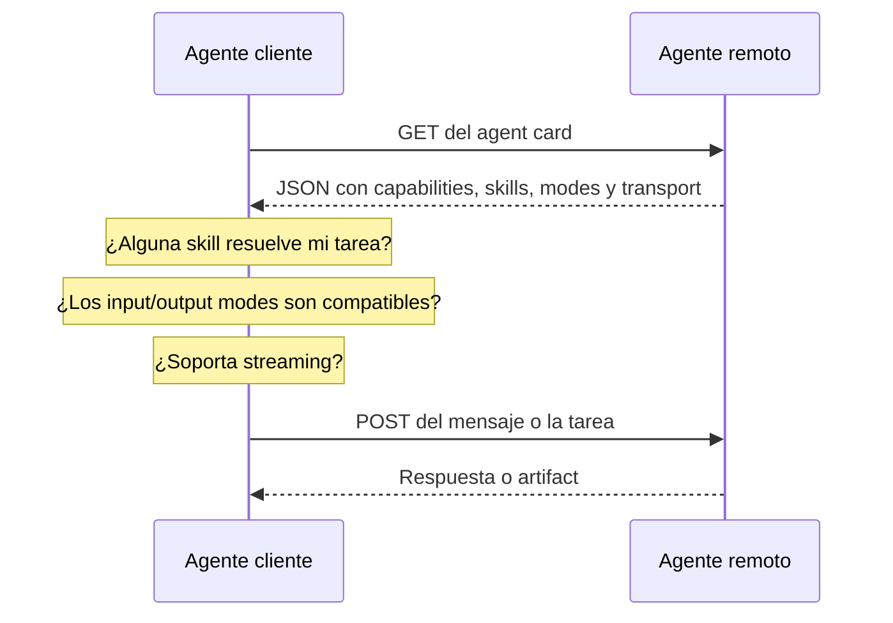
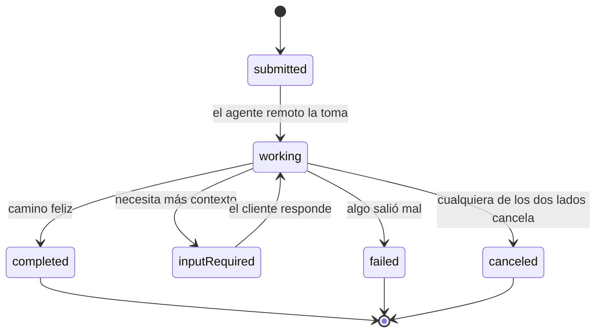
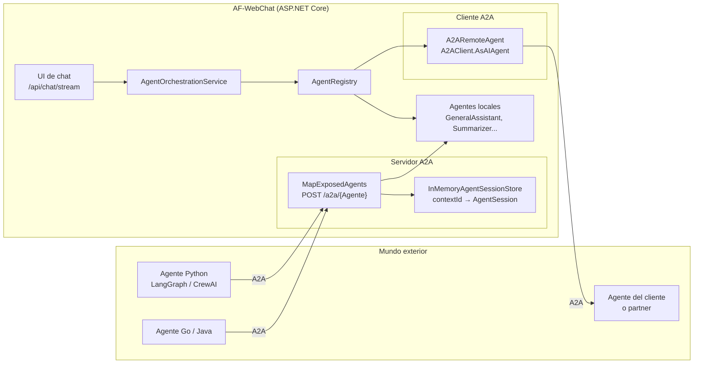
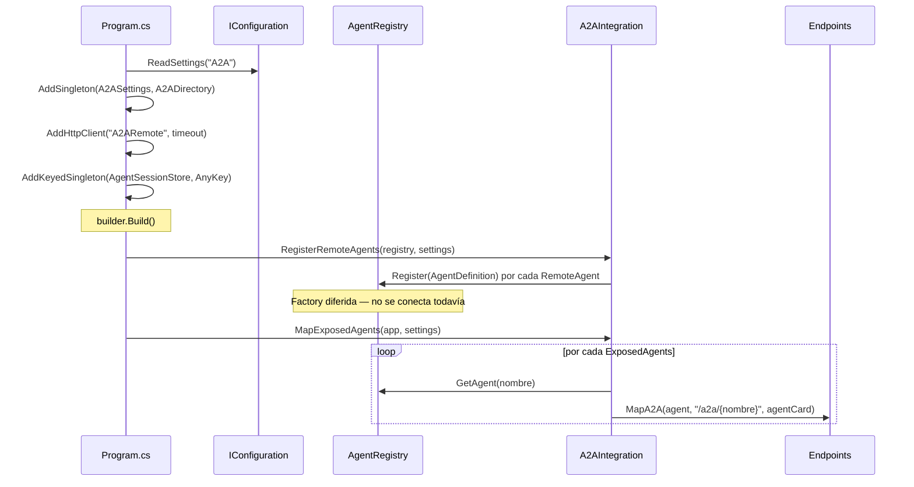
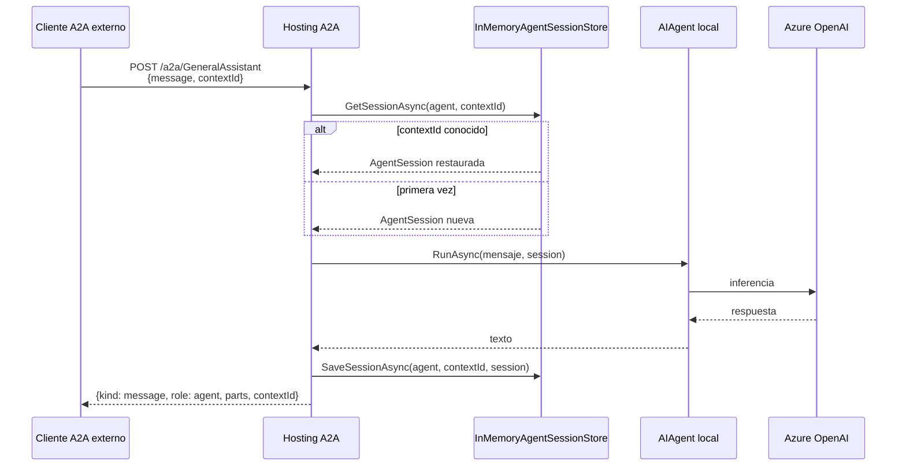
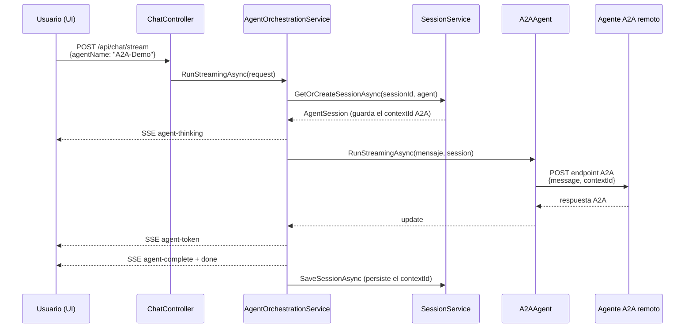
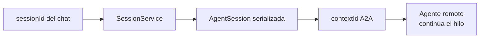

# Protocolo A2A (Agent2Agent) en AF-WebChat

> **Fuentes oficiales:** [A2A Integration — Agent Framework](https://learn.microsoft.com/en-us/agent-framework/integrations/a2a?pivots=programming-language-csharp) · [Especificación A2A](https://a2a-protocol.org/latest/) · [Agent Discovery](https://github.com/a2aproject/A2A/blob/main/docs/topics/agent-discovery.md) · [microsoft/agent-framework](https://github.com/microsoft/agent-framework)
> **Última actualización:** 28 de julio, 2026
> **Aplica a:** `02-AFWebChat` (app C#/.NET 9)

---

## 📋 Tabla de contenidos

- [Resumen ejecutivo (TL;DR)](#-resumen-ejecutivo-tldr)
- [Qué es A2A y en qué se diferencia de MCP](#-qué-es-a2a-y-en-qué-se-diferencia-de-mcp)
- [Agent cards y descubrimiento de capacidades](#-agent-cards-y-descubrimiento-de-capacidades)
- [Tasks, mensajes y ciclo de vida](#-tasks-mensajes-y-ciclo-de-vida)
- [Arquitectura en AF-WebChat](#-arquitectura-en-af-webchat)
- [Flujo detallado](#-flujo-detallado)
- [Configuración](#-configuración)
- [Endpoints](#-endpoints)
- [Piezas de código](#-piezas-de-código)
- [Sesiones y memoria conversacional](#-sesiones-y-memoria-conversacional)
- [Cómo hacer la demo](#-cómo-hacer-la-demo)
- [Conectar un agente remoto real](#-conectar-un-agente-remoto-real)
- [Versiones y compatibilidad de paquetes](#-versiones-y-compatibilidad-de-paquetes)
- [Troubleshooting](#-troubleshooting)
- [Seguridad y producción](#-seguridad-y-producción)
- [Referencias](#-referencias)

---

## 🎯 Resumen ejecutivo (TL;DR)

AF-WebChat implementa A2A en **las dos direcciones**:

| Dirección | Qué hace | Config | Resultado |
| --- | --- | --- | --- |
| **Servidor** | Publica agentes locales como servidores A2A | `A2A:ExposedAgents` | `POST /a2a/{Agente}` invocable desde cualquier framework |
| **Cliente** | Consume agentes A2A remotos | `A2A:RemoteAgents` | Aparecen en el catálogo del chat con categoría `A2A` |

**La idea clave:** un agente A2A remoto se envuelve en un `AIAgent` estándar del Agent Framework. A partir de ahí es **indistinguible** de un agente local — streaming, sesiones, workflows y orquestaciones funcionan igual sin tocar una línea del pipeline existente.

Esto convierte a A2A en el **tercer tipo de agente** del proyecto:

| Tipo | Dónde corre el modelo | Dónde vive la lógica |
| --- | --- | --- |
| **Código** | Azure OpenAI | En proceso (`Agents/**`) |
| **Foundry** | Azure AI Foundry | Servicio de Azure (agente versionado) |
| **A2A** | Donde sea | **Otro servicio, framework o lenguaje** |

---

## 🧩 Qué es A2A y en qué se diferencia de MCP

**A2A (Agent2Agent)** es un protocolo abierto para que **agentes** se comuniquen entre sí, sin importar el framework, lenguaje o nube en que estén construidos. Cubre:

- **Descubrimiento** mediante *agent cards* (metadatos: nombre, descripción, capacidades, skills)
- **Mensajería** entre agentes con identidad de conversación (`contextId`)
- **Tareas de larga duración** para trabajo asíncrono
- **Interoperabilidad** entre frameworks distintos

### A2A vs MCP

Se confunden seguido porque ambos son protocolos abiertos, pero resuelven problemas distintos:

| | **MCP** (Model Context Protocol) | **A2A** (Agent2Agent) |
| --- | --- | --- |
| **Conecta** | Un agente con **herramientas y datos** | Un agente con **otro agente** |
| **El otro lado es** | Una función, un recurso, un prompt | Un peer autónomo que razona y decide |
| **La interacción es** | Una llamada a función: *fire and forget*, un round trip | Una **conversación** con estados y turnos |
| **Granularidad** | Llamada a herramienta | Delegación de una tarea completa |
| **Analogía** | El agente usa un destornillador | El agente le pide ayuda a un colega |
| **En este repo** | `McpTools` (categoría `MCP`) | `A2A-Demo` (categoría `A2A`) |

La diferencia de fondo está en **qué hay del otro lado**. Cuando tu agente llama una herramienta por MCP, invoca una función: entra input estructurado, sale output estructurado, se acabó. La herramienta no piensa, no planea y no hace preguntas de seguimiento.

Cuando tu agente delega a otro agente por A2A, está hablando con un **peer autónomo**. Ese peer puede razonar sobre la petición, partirla en sub-pasos, **pedir aclaraciones** antes de responder y **emitir resultados parciales** mientras trabaja. Por eso A2A define un ciclo de vida de tarea con estados, y MCP no lo necesita.

> 💡 **No compiten, se complementan.** Un agente A2A remoto puede internamente usar MCP para sus herramientas. La regla práctica: **MCP dentro de tus agentes, A2A entre tus agentes.** AF-WebChat soporta ambos.

---

## 🪪 Agent cards y descubrimiento de capacidades

Antes de que un agente pueda delegarle trabajo a otro, necesita responder tres preguntas: **quién es este agente**, **qué sabe hacer** y **cómo le hablo**. El *agent card* responde las tres.

Es un documento JSON que todo agente A2A publica, y que cualquier cliente puede leer para decidir si ese agente es el indicado para la tarea.

### Anatomía de un agent card

Este es el card **real** que publica nuestro `GeneralAssistant` (recortado para lectura):

```json
{
  "name": "GeneralAssistant",
  "description": "Asistente conversacional de propósito general...",
  "url": "http://localhost:5000/a2a/GeneralAssistant",
  "version": "1.0.0",
  "protocolVersion": "0.3.0",
  "preferredTransport": "JSONRPC",
  "capabilities": {
    "streaming": true,
    "pushNotifications": false,
    "stateTransitionHistory": false
  },
  "defaultInputModes": [ "text" ],
  "defaultOutputModes": [ "text" ],
  "skills": [
    {
      "id": "generalassistant",
      "name": "GeneralAssistant",
      "description": "Asistente conversacional de propósito general...",
      "tags": [ "Básico" ],
      "examples": [
        "¿Qué es Semantic Kernel y cómo funciona?",
        "Explica la diferencia entre agentes y plugins"
      ]
    }
  ]
}
```

| Campo | Para qué sirve |
| --- | --- |
| `name` / `description` | **Quién es.** Identifica al agente ante el cliente |
| `url` | **Dónde vive.** El endpoint al que se le mandan las tareas |
| `version` | Versión del **agente** — sirve para rastrear cambios en sus capacidades |
| `protocolVersion` | Versión del **protocolo A2A** que habla (aquí `0.3.0`) |
| `preferredTransport` | **Cómo hablarle.** `JSONRPC` o `HTTP+JSON` |
| `capabilities.streaming` | Si el cliente puede suscribirse a avances o solo recibe la respuesta final |
| `capabilities.pushNotifications` | Si puede notificar de forma asíncrona el fin de una tarea larga |
| `defaultInputModes` / `defaultOutputModes` | **Qué tipos de contenido acepta y devuelve.** Aquí solo texto plano |
| `skills[]` | **Qué sabe hacer.** Cada skill con `id`, `name`, `description`, `tags` y `examples` |

> 💡 El array `skills` es lo que un agente cliente **lee para enrutar**. Ante la pregunta *"¿puedes analizar contratos?"*, el cliente compara la tarea contra la `description` y los `examples` de cada skill. Por eso vale la pena que sean descriptivos: son el índice sobre el que otros agentes deciden.

### El flujo de descubrimiento



Lo importante es que **esto ocurre en tiempo de ejecución**. El cliente no necesita saber en tiempo de compilación qué agentes existen ni dónde viven: solo necesita saber **dónde encontrar agent cards**.

### El descubrimiento es también una negociación

Descubrir no es solo encontrar al agente, es acordar **cómo se van a comunicar**, y eso pasa **antes** de mandar la primera tarea — así se evitan formatos incompatibles y peticiones fallidas:

| Qué revisa el cliente | Para qué |
| --- | --- |
| `defaultInputModes` | Si vas a mandar un PDF pero el agente solo acepta texto plano, hay que convertir el documento o escoger otro agente |
| `defaultOutputModes` | Para saber qué esperar de vuelta y si tu pipeline lo puede procesar |
| `capabilities.streaming` | Si soporta streaming, el cliente se suscribe a los avances; si no, manda la petición y espera el resultado final |
| `preferredTransport` | Para elegir el binding correcto (JSON-RPC o HTTP+JSON) |

### Las tres formas de descubrir un agente

La especificación define tres mecanismos, y el Agent Framework tiene una API para cada uno:

| Mecanismo | Cómo funciona | API en .NET | ¿Se usa aquí? |
| --- | --- | --- | --- |
| **Well-Known URI** | El card se publica en `https://{dominio}/.well-known/agent-card.json` ([RFC 8615](https://datatracker.ietf.org/doc/html/rfc8615)) | `A2ACardResolver.GetAIAgentAsync(...)` | No |
| **Registro curado** | Un servicio intermedio agrega los cards de todos los agentes desplegados y permite buscarlos por skill o tag | `MapA2A(...)` publica el agente para ser catalogado | Parcial — `GET /api/a2a` es un mini-registro propio |
| **Configuración directa** | El cliente trae la URL del agente en su configuración | `A2AClient.AsAIAgent(...)` | **Sí** — vía `A2A:RemoteAgents` |

AF-WebChat usa **configuración directa** porque es lo más predecible para demos y entornos controlados: agregas la URL en `appsettings` y listo. En un sistema de producción con muchos agentes, lo natural es montar un **registro** que agregue los cards de todo lo desplegado y que los clientes consulten por capacidad.

> ⚠️ La ruta *well-known* de nuestro servidor **no es usable hoy**: el SDK A2A 0.3.4 registra dos handlers en esa ruta y devuelve HTTP 500 ([issue #476](https://github.com/microsoft/agent-framework/issues/476)). Para leer el card usa `GET /a2a/{Agente}/v1/card`.

Para verlo en vivo, basta con pedirlo:

```bash
curl http://localhost:5000/a2a/GeneralAssistant/v1/card | python -m json.tool
```

Cualquier cliente A2A puede leer exactamente ese documento y saber todo lo que necesita para empezar a mandarle tareas.

---

## 📨 Tasks, mensajes y ciclo de vida

Una vez que un agente encuentra a su peer por el agent card, el siguiente paso es **mandarle trabajo**.

### Task: la unidad de trabajo

| Campo | Qué contiene |
| --- | --- |
| `id` | Identificador de la tarea |
| `contextId` | Identificador de sesión — agrupa tareas de la misma conversación |
| `status` | Estado actual dentro del ciclo de vida |
| `history[]` | Los mensajes intercambiados entre usuario y agente durante la tarea |
| `artifacts[]` | La **salida final** del trabajo |

### Message y Part: cómo fluye el contexto

Cada mensaje tiene un `role` (`user` o `agent`), un `messageId` y un array de `parts`. Los **parts** son los bloques de construcción y son los que cargan el contenido real:

| Tipo de part | Contenido |
| --- | --- |
| `text` | Texto plano |
| `file` | Archivos (bytes o URI) |
| `data` | Datos estructurados (JSON) |

Un mismo mensaje puede llevar **varios parts de tipos distintos**: por ejemplo, un agente revisor de contratos puede devolver un resumen en texto en un part y una evaluación de riesgo en JSON estructurado en otro. Los mensajes se van **acumulando** a lo largo de la vida de la tarea, y esa acumulación es la memoria de la conversación.

> 💡 La estructura se parece a las APIs de chat que ya conoces. La diferencia es que las tasks de A2A están diseñadas para comunicación **agente↔agente**, no solo humano↔agente.

### El ciclo de vida



| Estado | Significado |
| --- | --- |
| `submitted` | La tarea fue enviada y espera ser tomada |
| `working` | El agente remoto está trabajando en ella |
| `input-required` | El agente **necesita más información** y le devuelve la pelota al cliente |
| `completed` | Terminó — el cliente recibe el artifact con el resultado |
| `failed` | Falló |
| `canceled` | Cancelada; cualquiera de los dos lados puede hacerlo en cualquier momento |

El estado `input-required` es justo lo que separa A2A de una llamada a API tradicional: como el agente remoto es **autónomo**, tiene derecho a pedir aclaraciones antes de continuar. Una tarea de A2A no es una petición, es una conversación.

### Streaming y artifacts

Dos conceptos cierran el panorama:

- **Streaming** — permite que el agente mande avances de progreso *mientras* la tarea corre, en lugar de dejar al cliente esperando a ciegas.
- **Artifacts** — son la **salida final** de la tarea, separada de los mensajes intermedios del `history`.

### Cómo aplica esto en AF-WebChat hoy

La implementación actual usa el modo **mensaje directo**, no tasks de larga duración:

| Concepto A2A | Estado en AF-WebChat |
| --- | --- |
| `contextId` | **Usado y soportado.** Es la identidad de la conversación (ver [Sesiones](#-sesiones-y-memoria-conversacional)) |
| Parts de tipo `text` | **Usados.** `defaultInputModes` y `defaultOutputModes` son `text` |
| Parts de tipo `file` / `data` | No usados todavía |
| Task con ciclo de vida | **No se usa.** El hosting corre en `AgentRunMode.DisallowBackground`, así que la respuesta es un `kind: "message"` directo, nunca un `kind: "task"` |
| `input-required` | No aplica mientras no haya tasks |
| Streaming | El card lo declara y los endpoints SSE responden, pero llega **un solo evento** con la respuesta completa |

Eso es exactamente lo que quieres para un chat interactivo: baja latencia y una respuesta por turno. El modo con tasks en background tiene sentido cuando delegas trabajo que tarda minutos u horas — analizar un contrato completo, procesar un lote de documentos — y necesitas poder consultar el avance.

### Por qué el agente A2A no strea token a token

Es la pregunta que surge al primer uso: en la UI, `GeneralAssistant` escribe palabra por palabra, pero **A2A-Demo aparece de golpe**. No es un bug de la UI ni del cliente.

La causa está en el protocolo. En A2A, un `AgentMessage` es **atómico**: no existe el concepto de "mensaje parcial". Lo que A2A strea son **actualizaciones de una task** (cambios de estado y fragmentos de artifact). Como el hosting corre en `AgentRunMode.DisallowBackground`, la respuesta es un mensaje y no hay task — así que no hay nada incremental que enviar.

Medido contra esta app:

| Endpoint | Content-Type | Eventos recibidos |
| --- | --- | --- |
| `/v1/message:send` | `application/json` | 1 (respuesta completa) |
| `/v1/message:stream` | `text/event-stream` | **1** (respuesta completa) |
| `POST /a2a/{Agente}` con `message/stream` | `text/event-stream` | **1** (respuesta completa) |

Los endpoints SSE **sí existen y responden 200**, por eso el agent card declara `"streaming": true` — el transporte está soportado. Simplemente el flujo emite un único evento.

> 🧪 **Probado y descartado: cambiar a `AgentRunMode.AllowBackgroundIfSupported`.** Es el arreglo que parece obvio y **no funciona**. La respuesta pasa a `kind: "task"` con `state: "working"`, pero **sigue llegando un solo evento** — no hay chunks. Y además **rompe el cliente**: `A2AAgent` recibe una tarea incompleta, no hace polling, y el chat devuelve texto vacío. Verificado en esta app y revertido.

Para tener streaming real por A2A haría falta que la capa de hosting emitiera `TaskArtifactUpdateEvent` incrementales, lo que esa versión del SDK no hace. Es una limitación de `Microsoft.Agents.AI.Hosting.A2A` 1.1.0-preview, no de tu configuración.

### Mitigación en la UI: revelado progresivo

Sin arreglo posible en el servidor, el problema se atacó del lado del cliente. Medido en la UI con un prompt de 320 palabras:

| | Actualizaciones del DOM | Primer texto | Ventana |
| --- | --- | --- | --- |
| **Antes** | 1 | 15.0 s | 0 ms — 2152 chars de golpe |
| **Después** | 20 | 11.9 s | 1.1 s — 38 → 150 → 262 → … → 2084 chars |

`chat.js` detecta que el agente es de categoría `A2A` y que el evento trae un bloque grande (> 200 caracteres), y lo revela por palabras en ~1.2 s con `revelarProgresivamente()`. Detalles de la implementación:

- **Solo aplica a categoría `A2A`.** Los agentes locales conservan su streaming nativo intacto — verificado: 107 actualizaciones en el mismo prompt.
- **El cierre del stream espera al revelado.** `finalizeStreamBubble` se ejecuta apenas termina el lector SSE, que con A2A ocurre inmediatamente después del único token. Sin `esperarRevelado()` el efecto se cortaría al instante.
- **Nunca pierde texto.** `detenerRevelado()` vuelca el texto completo, así que si el stream se cierra o el usuario cambia de agente a media animación, la respuesta se renderiza entera.

> ⚠️ Esto es **presentación, no streaming**. El dato ya llegó completo al cliente; solo se muestra de forma escalonada. No reduce la espera inicial — esos ~12 s siguen siendo la generación remota completa. Si en la demo alguien pregunta, dilo tal cual: el protocolo entrega el mensaje como una unidad y la UI lo despliega para no dar sensación de cuelgue.

**Qué significa en la práctica:** el `agent-thinking` de la UI aparece al instante, así que el usuario ve feedback de inmediato; lo que no verás es el texto apareciendo progresivamente. Para la demo, di simplemente que la respuesta viaja por HTTP como una unidad — que es exactamente lo que hace un agente remoto real.

---

## 🌐 Arquitectura en AF-WebChat



**Dos caminos independientes:**

1. **Entrante (servidor).** Un cliente externo llama a `/a2a/{Agente}`. El hosting A2A traduce el mensaje del protocolo a una invocación del `AIAgent` local y devuelve la respuesta en formato A2A.
2. **Saliente (cliente).** El usuario elige un agente de categoría `A2A` en la UI. `AgentOrchestrationService` lo trata como cualquier otro agente; por debajo, el `A2AAgent` hace la llamada HTTP al endpoint remoto.

---

## 🔁 Flujo detallado

### Arranque de la aplicación



Dos detalles de diseño importantes:

- Los agentes **remotos** se registran con una *factory diferida*: si el servidor remoto está caído, la app arranca igual y el error aparece en el primer uso, no en el arranque.
- Los agentes **expuestos** sí se instancian en el arranque (hay que pasarle la instancia a `MapA2A`). Si uno falla al crearse se registra un warning y se omite; los demás siguen publicándose.

### Entrante: alguien invoca nuestro agente



### Saliente: consumimos un agente remoto



> ⚠️ La respuesta A2A llega **completa, no token a token**: el binding de mensajes no es streaming. En el SSE verás **un solo** evento `agent-token` con todo el texto. Tampoco hay eventos `agent-reasoning` en la ruta A2A — el razonamiento se queda del lado del agente remoto.

---

## ⚡ Configuración

Todo vive bajo la sección `A2A` de `appsettings.json` (y su override en `appsettings.Development.json`).

```json
{
  "A2A": {
    "Enabled": true,
    "BasePath": "/a2a",
    "PublicBaseUrl": "http://localhost:5000",
    "RemoteTimeoutSeconds": 300,
    "ExposedAgents": [ "GeneralAssistant", "Summarizer", "Translator" ],
    "RemoteAgents": [
      {
        "Name": "A2A-Demo",
        "Url": "http://localhost:5000/a2a/GeneralAssistant",
        "Description": "Demo del protocolo A2A",
        "Icon": "🛰️",
        "Color": "#7b61ff",
        "ExamplePrompts": [
          "Preséntate en una frase: ¿quién eres y qué puedes hacer?",
          "Recuerda que mi proyecto se llama Fénix. Responde solo OK.",
          "¿Cómo se llama mi proyecto?"
        ]
      }
    ]
  }
}
```

### Propiedades

| Propiedad | Tipo | Default | Descripción |
| --- | --- | --- | --- |
| `Enabled` | bool | `true` | Interruptor maestro. En `false` no se publica ni se registra nada de A2A |
| `BasePath` | string | `/a2a` | Prefijo de ruta de los endpoints publicados |
| `PublicBaseUrl` | string | `http://localhost:5000` | URL pública del host. Solo se usa para construir el campo `url` del *agent card* |
| `RemoteTimeoutSeconds` | int | `300` | Timeout HTTP hacia agentes remotos. El default de .NET (100 s) se queda corto con modelos de razonamiento |
| `ExposedAgents` | string[] | `[]` | Nombres de agentes del `AgentRegistry` a publicar como servidores A2A |
| `RemoteAgents` | objeto[] | `[]` | Agentes A2A remotos a registrar en el catálogo |

### Propiedades de cada `RemoteAgents[]`

| Propiedad | Requerido | Descripción |
| --- | --- | --- |
| `Name` | Sí | Nombre con el que aparece en el catálogo. Es la clave del registry |
| `Url` | Sí | Endpoint A2A del agente remoto — la **raíz del agente**, sin `/v1/...` |
| `Description` | No | Texto en la tarjeta. Si se omite se genera uno con la URL |
| `Icon` | No | Emoji del catálogo. Default `🛰️` |
| `Color` | No | Color del ícono. Default `#7b61ff` |
| `ExamplePrompts` | No | Prompts sugeridos en la UI |

### Reglas de validación

- `Url` debe ser **absoluta** y con esquema `http` o `https`; si no, el agente se omite con un warning y la app sigue arrancando.
- Un agente listado en `ExposedAgents` que no exista en el registry se omite con warning.
- Un agente de categoría `A2A` **no se vuelve a publicar** aunque esté en `ExposedAgents` — evita crear un bucle de proxy sin valor.

---

## 📡 Endpoints

### Publicados por AF-WebChat (servidor)

| Endpoint | Método | Binding | Uso |
| --- | --- | --- | --- |
| `/a2a/{Agente}` | POST | JSON-RPC | El que usa `A2AClient` del Agent Framework |
| `/a2a/{Agente}/v1/message:send` | POST | HTTP+JSON | Ideal para `curl`, Postman y demos |
| `/a2a/{Agente}/v1/card` | GET | HTTP+JSON | Agent card (metadatos y skills) |

### Propio de la app (descubrimiento)

| Endpoint | Método | Descripción |
| --- | --- | --- |
| `/api/a2a` | GET | Directorio A2A: qué agentes están publicados y qué remotos están conectados |

Respuesta de `/api/a2a`:

```json
{
  "enabled": true,
  "basePath": "/a2a",
  "exposedAgents": [
    {
      "name": "GeneralAssistant",
      "description": "Asistente conversacional de propósito general...",
      "path": "/a2a/GeneralAssistant",
      "url": "http://localhost:5000/a2a/GeneralAssistant",
      "agentCardUrl": "http://localhost:5000/a2a/GeneralAssistant/v1/card"
    }
  ],
  "remoteAgents": [
    {
      "name": "A2A-Demo",
      "description": "Demo del protocolo A2A...",
      "url": "http://localhost:5000/a2a/GeneralAssistant",
      "registered": true
    }
  ]
}
```

### Formato del mensaje A2A

```json
{
  "message": {
    "kind": "message",
    "role": "user",
    "messageId": null,
    "contextId": "demo-1",
    "parts": [
      { "kind": "text", "text": "Hola, ¿qué puedes hacer?" }
    ]
  }
}
```

| Campo | Obligatorio | Descripción |
| --- | --- | --- |
| `kind` (del mensaje) | **Sí** | Siempre `"message"`. Si falta → **HTTP 400** |
| `role` | **Sí** | `"user"` cuando lo manda el cliente |
| `messageId` | **La propiedad sí; el valor no** | ID único del mensaje. Puede ir en `null` y el agente genera uno, pero **la propiedad tiene que estar presente** |
| `contextId` | No | **Identidad de la conversación.** Reusarlo continúa el hilo; cambiarlo empieza uno nuevo. Si se omite, el agente genera uno |
| `parts[].kind` | **Sí** | Tipo del part. Hoy se usa `"text"`. Si falta → **HTTP 500** |
| `parts[].text` | **Sí** | El contenido del mensaje |

> ⚠️ **El error más común.** Omitir `messageId` devuelve un `400` con este mensaje:
>
> ```text
> JSON deserialization for type 'A2A.AgentMessage' was missing required properties including: 'messageId'.
> ```
>
> El SDK A2A 0.3.4 marca `messageId` como propiedad **requerida en el contrato**, aunque acepte `null` como valor. Mándalo siempre — con un GUID o con `null`, pero mándalo.

---

## 🔧 Piezas de código

| Archivo | Rol |
| --- | --- |
| [Models/A2ASettings.cs](../Models/A2ASettings.cs) | `A2ASettings`, `A2ARemoteAgentSettings` y los records de descubrimiento |
| [Agents/A2A/A2ARemoteAgent.cs](../Agents/A2A/A2ARemoteAgent.cs) | **Cliente**: convierte un endpoint remoto en `AgentDefinition` |
| [Services/A2AIntegration.cs](../Services/A2AIntegration.cs) | **Servidor**: publica agentes, construye agent cards, mantiene `A2ADirectory` |
| [Services/InMemoryAgentSessionStore.cs](../Services/InMemoryAgentSessionStore.cs) | Memoria conversacional por `contextId` |
| [Controllers/A2AController.cs](../Controllers/A2AController.cs) | `GET /api/a2a` |
| [Program.cs](../Program.cs) | Registro en DI y mapeo de endpoints |

### Cliente: agente remoto → `AIAgent`

Todo el puente cabe en tres líneas. `AsAIAgent` es un método de extensión del namespace `A2A`:

```csharp
var client = new A2AClient(endpoint, httpClientFactory.CreateClient(HttpClientName));

return client.AsAIAgent(
    id: settings.Name,
    name: settings.Name,
    description: description,
    loggerFactory: loggerFactory);
```

El resultado es un `AIAgent` normal, así que el `AgentRegistry`, el `SessionService`, los workflows y las orquestaciones lo consumen sin cambios.

### Servidor: `AIAgent` → endpoint A2A

```csharp
var path = $"{basePath}/{name}";
app.MapA2A(agent, path, BuildAgentCard(definition, absoluteUrl));
```

El *agent card* se construye desde el `AgentDefinition` que ya existía, así que los metadatos del catálogo y los del protocolo nunca se desincronizan:

| Campo del AgentCard | Origen |
| --- | --- |
| `name` / `description` | `AgentDefinition.Name` / `.Description` |
| `url` | `PublicBaseUrl` + `BasePath` + nombre |
| `capabilities.streaming` | `AgentDefinition.SupportsStreaming` |
| `skills[].tags` | `AgentDefinition.Category` + `.Tools` |
| `skills[].examples` | `AgentDefinition.ExamplePrompts` |

### Registro en DI

```csharp
var a2aSettings = A2AIntegration.ReadSettings(builder.Configuration);
builder.Services.AddSingleton(a2aSettings);
builder.Services.AddSingleton<A2ADirectory>();

builder.Services.AddHttpClient(A2ARemoteAgent.HttpClientName,
    client => client.Timeout = TimeSpan.FromSeconds(a2aSettings.RemoteTimeoutSeconds));

builder.Services.AddKeyedSingleton<AgentSessionStore, InMemoryAgentSessionStore>(
    KeyedService.AnyKey);
```

---

## 🧠 Sesiones y memoria conversacional

Esta es la parte con más trampa del protocolo, y merece leerse completa.

### El `contextId` es la conversación

A2A no tiene "sesiones" al estilo HTTP. La identidad de la conversación viaja en el campo `contextId` del mensaje. Dos mensajes con el mismo `contextId` pertenecen al mismo hilo; con distinto `contextId`, son hilos separados.

### Del lado servidor: hay que registrar un store

El hosting A2A resuelve el store de sesiones así:

```csharp
var agentSessionStore = endpoints.ServiceProvider
    .GetKeyedService<AgentSessionStore>(agent.Name);
```

> 🐛 **Si no hay ninguno registrado, el Agent Framework usa `NoopAgentSessionStore`** — un store que no guarda nada y devuelve una sesión nueva en cada llamada. El resultado es un servidor **stateless**: reusar el `contextId` no sirve de nada y el agente "olvida" todo entre mensajes. No hay error ni warning, simplemente no recuerda.

La solución es `InMemoryAgentSessionStore`, que serializa la `AgentSession` con las APIs estándar del framework:

```csharp
public override async ValueTask SaveSessionAsync(
    AIAgent agent, string conversationId, AgentSession session, CancellationToken ct = default)
{
    var state = await agent.SerializeSessionAsync(session, cancellationToken: ct);
    _sessions[conversationId] = new Entry(state, DateTimeOffset.UtcNow);
    // ...
}
```

Y se registra con `KeyedService.AnyKey`:

```csharp
builder.Services.AddKeyedSingleton<AgentSessionStore, InMemoryAgentSessionStore>(
    KeyedService.AnyKey);
```

**¿Por qué `AnyKey`?** Porque el lookup es por `agent.Name`, pero los agentes se instancian **después** de `builder.Build()`, cuando ya no se pueden registrar servicios. `AnyKey` hace que cualquier clave resuelva, y el contenedor crea una instancia distinta por agente. Cero acoplamiento con los nombres.

### Del lado cliente: el `contextId` viaja en la sesión

El `A2AAgent` guarda el `contextId` dentro de la `AgentSession`. Como `SessionService` ya serializa y restaura sesiones por `sessionId`, la continuidad funciona sola:



Para validarlo por este lado no mandas `contextId` a mano — mandas el `sessionId` del chat y el `contextId` viaja solo, escondido dentro de la sesión:

```powershell
function Chat($texto, $sid) {
    $b = @{ sessionId = $sid; message = $texto; agentName = 'A2A-Demo' } | ConvertTo-Json
    (Invoke-RestMethod 'http://localhost:5000/api/chat/send' `
        -Method Post -ContentType 'application/json' -Body $b).text
}

$sid = "chat-$([guid]::NewGuid())"
Chat 'Mi proyecto se llama Fénix. Responde solo OK.'               $sid
Chat 'El presupuesto es de 250 mil dólares. Responde solo OK.'      $sid
Chat 'Sin preguntarme nada: repite el nombre del proyecto y su presupuesto en una sola línea.' $sid
```

Si el tercer turno responde `Fénix - 250 mil dólares`, la cadena completa está viva: `sessionId` → `AgentSession` → `contextId` → HTTP A2A → store del servidor. Es el recorrido más largo del sistema, así que este único turno valida las dos direcciones de golpe.

### Verificarlo

```bash
# Turno 1 — se le da un dato
curl -X POST http://localhost:5000/a2a/GeneralAssistant/v1/message:send \
  -H "Content-Type: application/json" \
  -d '{"message":{"kind":"message","role":"user","messageId":null,"contextId":"prueba-1",
       "parts":[{"kind":"text","text":"Mi color favorito es el verde."}]}}'

# Turno 2 — MISMO contextId: debe recordarlo
curl -X POST http://localhost:5000/a2a/GeneralAssistant/v1/message:send \
  -H "Content-Type: application/json" \
  -d '{"message":{"kind":"message","role":"user","messageId":null,"contextId":"prueba-1",
       "parts":[{"kind":"text","text":"¿Cuál es mi color favorito?"}]}}'
```

En PowerShell (Windows), donde `curl` es un alias de `Invoke-WebRequest`:

```powershell
$uri = 'http://localhost:5000/a2a/GeneralAssistant/v1/message:send'
function Send-A2A($texto, $ctx) {
    $body = @{ message = @{
        kind = 'message'; role = 'user'; messageId = $null; contextId = $ctx
        parts = @(@{ kind = 'text'; text = $texto })
    } } | ConvertTo-Json -Depth 8
    (Invoke-RestMethod $uri -Method Post -ContentType 'application/json' -Body $body).parts[0].text
}

Send-A2A 'Mi color favorito es el verde.' 'prueba-1'
Send-A2A '¿Cuál es mi color favorito?'   'prueba-1'
```

Si el segundo turno responde "verde", la memoria conversacional está bien. Si responde "no tengo forma de saberlo", falta el store.

### Una prueba más sólida: acumulación + control

Dos turnos prueban poco. El modelo podría acertar por casualidad, y aunque el store estuviera roto de forma parcial no te enterarías. Para estar seguro hacen falta dos cosas más:

- **Un tercer turno acumulativo** que obligue a combinar datos de turnos **distintos**. Si el agente solo arrastrara el mensaje inmediato anterior, este turno falla.
- **Un turno de control** con un `contextId` nuevo, que **debe fallar**. Sin él no estás probando memoria, solo estás probando que el modelo contesta.

```powershell
$ctx = "sesion-$([guid]::NewGuid())"

Send-A2A 'Mi proyecto se llama Fénix. Responde solo OK.'          $ctx
Send-A2A 'El presupuesto es de 250 mil dólares. Responde solo OK.' $ctx
Send-A2A 'Sin preguntarme nada: repite el nombre del proyecto y su presupuesto en una sola línea.' $ctx

# Control — mismo prompt, contextId NUEVO: debe decir que no lo sabe
Send-A2A 'Sin preguntarme nada: repite el nombre del proyecto y su presupuesto en una sola línea.' "control-$([guid]::NewGuid())"
```

Salida esperada:

```text
T1 >> OK
T2 >> OK
T3 >> Fénix - 250 mil dólares

CONTROL >> No has indicado el nombre del proyecto ni su presupuesto...
```

| Resultado | Qué significa |
| --- | --- |
| T3 trae **ambos** datos y el control falla | ✅ La memoria por `contextId` funciona y las sesiones están aisladas |
| T3 trae solo el dato del turno 2 | El store guarda, pero no acumula el historial completo |
| T3 falla | No hay `AgentSessionStore` registrado — está usando el `NoopAgentSessionStore` |
| El **control responde** con los datos | 🚨 Grave: las sesiones se están mezclando entre `contextId` distintos |

> 💡 El *"sin preguntarme nada"* del prompt no es adorno: sin eso el modelo tiende a responder con una pregunta de aclaración en vez de con el dato, y la prueba queda ambigua.

---

## 🚀 Cómo hacer la demo

`appsettings.Development.json` trae un agente **A2A-Demo** que apunta al **propio** endpoint de la app. Eso hace que AF-WebChat sea servidor y cliente A2A al mismo tiempo, así que la demo funciona sin depender de nada externo.

```bash
cd 02-AFWebChat
dotnet run --launch-profile http
```

### Guion sugerido

**1. Enseña que el agente es A2A-compliant.** Abre el agent card en el navegador:

```text
http://localhost:5000/a2a/GeneralAssistant/v1/card
```

Ahí se ve el nombre, la descripción, las capacidades y los skills — exactamente lo que otro framework necesita para descubrir el agente.

**2. Invócalo como lo haría un tercero.** Desde `curl` o Postman:

```bash
curl -X POST http://localhost:5000/a2a/GeneralAssistant/v1/message:send \
  -H "Content-Type: application/json" \
  -d '{"message":{"kind":"message","role":"user","messageId":null,"contextId":"demo",
       "parts":[{"kind":"text","text":"Preséntate en una frase: ¿quién eres y qué puedes hacer?"}]}}'
```

Si vas a hacer la demo desde PowerShell, usa esto en su lugar — `curl` ahí es un alias de `Invoke-WebRequest` y no acepta la sintaxis de arriba:

```powershell
$body = @{ message = @{
    kind = 'message'; role = 'user'; messageId = $null; contextId = 'demo'
    parts = @(@{ kind = 'text'; text = 'Preséntate en una frase: ¿quién eres y qué puedes hacer?' })
} } | ConvertTo-Json -Depth 8

Invoke-RestMethod 'http://localhost:5000/a2a/GeneralAssistant/v1/message:send' `
    -Method Post -ContentType 'application/json' -Body $body | ConvertTo-Json -Depth 6
```

La respuesta trae la identidad del agente — *"Soy AF-WebChat Assistant…"* —, que es justo lo que quieres mostrar: del otro lado del protocolo hay **tu** agente respondiendo.

> 💡 **No olvides `messageId`.** Es la propiedad que más se omite y la que rompe la demo con un `400`. Ver [Formato del mensaje A2A](#formato-del-mensaje-a2a).
>
> ⚠️ **No le preguntes al agente qué es A2A.** El modelo no conoce el protocolo (es posterior a su fecha de corte) y responde de forma **inconsistente**: a veces lo explica bien, a veces lo confunde con *"account-to-account"* (transferencias bancarias) y a veces afirma que **no existe**. Frente a un cliente eso destruye el mensaje. La demo prueba el **transporte**, no lo que el modelo sabe — usa el prompt de presentación de arriba o cualquier tarea genérica (*"resume este párrafo"*, *"traduce esto al inglés"*).

Mensaje: *"esto mismo lo puede llamar un agente en Python, Go o Java — no saben ni les importa que del otro lado hay .NET."*

**3. Enseña el directorio.** `GET http://localhost:5000/api/a2a` muestra de un vistazo qué se publica y qué se consume.

**4. Cambia de dirección.** En el chat selecciona el agente **A2A-Demo** 🛰️ y conversa. Explica que ese agente **no corre en proceso**: cada mensaje sale por HTTP hablando A2A. El log lo confirma:

```text
info: Microsoft.Agents.AI.A2A.A2AAgent[...]
      [RunStreamingAsync] A2AAgent A2A-Demo/A2A-Demo invoked underlying A2A agent.
info: System.Net.Http.HttpClient.A2ARemote.ClientHandler[100]
      Sending HTTP request POST http://localhost:5000/a2a/GeneralAssistant
```

**5. Cierre.** Los prompts sugeridos del agente están armados como pareja para demostrar la memoria: manda *"Recuerda que mi proyecto se llama Fénix"* y luego *"¿Cómo se llama mi proyecto?"*. El agente responde **Fénix**, lo que prueba que el `contextId` viaja y que el store de sesiones del servidor está haciendo su trabajo. Remata: *"para conectar el agente real del cliente solo cambio una URL en configuración."*

---

## 🔌 Conectar un agente remoto real

Basta con agregar una entrada a `A2A:RemoteAgents` y reiniciar:

```json
{
  "Name": "AgenteDelCliente",
  "Url": "https://agentes.cliente.com/a2a/soporte",
  "Description": "Agente de soporte del cliente (Python + LangGraph)",
  "Icon": "🤝",
  "Color": "#e94560"
}
```

No hace falta tocar código: aparece solo en el catálogo bajo la categoría `A2A` y queda disponible para chat, workflows y orquestaciones.

### Del otro lado (ejemplo en Python)

Si el partner usa Agent Framework en Python, expone su agente así:

```python
from a2a.server.request_handlers import DefaultRequestHandler
from a2a.server.tasks import InMemoryTaskStore
from agent_framework.a2a import A2AExecutor

request_handler = DefaultRequestHandler(
    agent_executor=A2AExecutor(agent, stream=True),
    task_store=InMemoryTaskStore(),
    agent_card=public_agent_card,
)
```

### Checklist de integración

| Punto | Qué verificar |
| --- | --- |
| **URL** | Que sea la **raíz del agente**, no `/v1/message:send` ni el well-known |
| **Alcance de red** | Que el host de AF-WebChat pueda salir a esa URL (firewall, VNet, proxy) |
| **TLS** | Certificado válido en `https`; los self-signed fallan |
| **Timeout** | Subir `RemoteTimeoutSeconds` si el agente remoto es lento |
| **Autenticación** | Si el endpoint la exige, hoy no hay soporte (ver abajo) |

> 🔐 **Autenticación remota.** La implementación actual llama a endpoints anónimos. Para endpoints protegidos hay que agregar el header en el `HttpClient` con nombre `A2ARemote` (`DelegatingHandler` o `ConfigureHttpClient`), leyendo el secreto de Key Vault o user-secrets. Nunca en `appsettings.json`.

---

## 📦 Versiones y compatibilidad de paquetes

```xml
<PackageReference Include="Microsoft.Agents.AI.A2A" Version="1.1.0-preview.260410.1" />
<PackageReference Include="Microsoft.Agents.AI.Hosting.A2A.AspNetCore" Version="1.1.0-preview.260410.1" />
```

Traen transitivamente el SDK oficial `A2A` y `A2A.AspNetCore` (0.3.4-preview).

> ⚠️ **No uses la última versión sin pensar.** La familia de paquetes A2A sigue su propio tren de versiones en preview y **arrastra la versión del core**. Instalar `1.15.0-preview` jala `Microsoft.Agents.AI 1.15.0`, lo que rompe el resto del proyecto. **La regla: alinea la versión de A2A con la de `Microsoft.Agents.AI` que ya resuelve la solución** (hoy `1.1.0`).

Efecto colateral del alineamiento: hubo que subir `Microsoft.Agents.AI.Workflows` de `1.0.0-rc5` a `1.1.0` (error `NU1605`), y esa versión marca `CreateHandoffBuilderWith` como experimental, así que en `OrchestrationFactory.cs` hay un `#pragma warning disable MAAIW001`.

### La API de A2A cambia entre versiones

| Versión | Cómo se publica un agente |
| --- | --- |
| `1.1.0-preview` (esta) | `app.MapA2A(agent, path, agentCard)` |
| `main` / `1.15` | `services.AddA2AServer(...)` + `app.MapA2AHttpJson(...)` / `MapA2AJsonRpc(...)` |

Si algún día se actualiza, **hay que leer el código fuente de esa versión concreta**, no el de `main`. Para encontrarlo: busca el commit por fecha en `api.github.com/repos/microsoft/agent-framework/commits?until=YYYY-MM-DD` y lee el archivo en ese SHA. El commit de la versión actual es `e5f7b9c260961916e108ca10780988aeefd51662`.

---

## 🚦 Troubleshooting

| Síntoma | Causa | Solución |
| --- | --- | --- |
| El agente remoto no aparece en el catálogo | `Enabled: false`, o `Url` inválida | Revisa el log: `A2A: no se pudo registrar el agente remoto '{Name}'` |
| `GET /api/a2a` devuelve `remoteAgents: []` y en el log **no** aparece `A2A-Demo` | `appsettings.Development.json` está en `.gitignore`, así que **no se versiona** y el bloque `A2A` se pierde al clonar o restaurar el repo | Vuelve a pegar la sección `A2A` de [Configuración](#-configuración) en `appsettings.Development.json` y reinicia |
| `/a2a/{Agente}` devuelve 404 | El agente no está en `ExposedAgents`, o el nombre no coincide | Revisa `GET /api/a2a` para ver qué quedó publicado |
| **HTTP 400** — `missing required properties including: 'messageId'` | El payload omite `messageId`. El SDK A2A 0.3.4 lo exige en el contrato, aunque acepte `null` como valor | Incluye la propiedad: `"messageId": null` o un GUID |
| **HTTP 400** al mandar un mensaje bien formado | Falta `"kind": "message"` en el objeto `message` | Agrégalo |
| **HTTP 500** al mandar un mensaje | Falta `"kind": "text"` en algún elemento de `parts` | Cada part necesita su `kind` |
| `curl` en PowerShell falla con parámetros raros | En PowerShell `curl` es alias de `Invoke-WebRequest` y no acepta `-X` / `-d` | Usa `Invoke-RestMethod` (ver [Cómo hacer la demo](#-cómo-hacer-la-demo)) o `curl.exe` |
| El agente no recuerda nada entre mensajes | Falta el `AgentSessionStore` (usa el Noop) | Registra `InMemoryAgentSessionStore` con `KeyedService.AnyKey` |
| `.well-known/agent.json` devuelve HTTP 500 | El SDK A2A 0.3.4 registra dos handlers en esa ruta ([issue #476](https://github.com/microsoft/agent-framework/issues/476)) | Usa `{path}/v1/card` en su lugar |
| `TaskCanceledException` al llamar al remoto | Timeout del `HttpClient` | Sube `RemoteTimeoutSeconds` |
| `NU1605 package downgrade` al restaurar | Versión de A2A desalineada con el core | Alinea con `Microsoft.Agents.AI` (ver arriba) |
| `CS0104: 'AgentSkill' is an ambiguous reference` | Colisión entre `A2A.AgentSkill` y `Microsoft.Agents.AI.AgentSkill` | Califica el tipo: `new A2A.AgentSkill { ... }` |
| El agente expuesto no se publica en el arranque | Su factory falló (falta config de Foundry, SQL, etc.) | Revisa el warning `no se pudo instanciar el agente '{Name}'` |
| Un solo evento `agent-token` en el SSE | Comportamiento esperado | El binding de mensajes A2A no es streaming |
| El agente A2A no escribe token a token en la UI, a diferencia de los locales | Limitación del hosting A2A 1.1.0-preview: un `AgentMessage` es atómico y no se emiten artifact updates incrementales | No tiene arreglo por configuración. **No** cambies a `AgentRunMode.AllowBackgroundIfSupported`: no agrega streaming y rompe al cliente (ver [Por qué el agente A2A no strea token a token](#por-qué-el-agente-a2a-no-strea-token-a-token)) |

### Log de arranque saludable

```text
info: AFWebChat.Agents.AgentRegistry[0]
      Registered agent definition: A2A-Demo (A2A)
info: AFWebChat.A2A[0]
      A2A: agente remoto 'A2A-Demo' registrado (http://localhost:5000/a2a/GeneralAssistant)
info: AFWebChat.A2A[0]
      A2A: agente 'GeneralAssistant' publicado en /a2a/GeneralAssistant
info: AFWebChat.A2A[0]
      A2A: agente 'Summarizer' publicado en /a2a/Summarizer
info: AFWebChat.A2A[0]
      A2A: agente 'Translator' publicado en /a2a/Translator
```

---

## 🔐 Seguridad y producción

Lo que hay hoy está pensado para **demos y desarrollo**. Antes de exponerlo a internet:

| Tema | Estado actual | Qué hacer en producción |
| --- | --- | --- |
| **Autenticación entrante** | Los endpoints `/a2a/**` son **anónimos** | Proteger con API Management, Entra ID o una API key. A2A soporta `securitySchemes` en el agent card |
| **Autenticación saliente** | Sin credenciales | Agregar el header en el `HttpClient` `A2ARemote`, con el secreto en Key Vault |
| **Store de sesiones** | En memoria, tope de 1000 con evicción LRU | Store distribuido (Redis / Cosmos DB) para multi-instancia |
| **Rate limiting** | No hay | Middleware de rate limiting o APIM, para que el endpoint no se vuelva un vector de consumo de tokens |
| **Superficie expuesta** | La define `ExposedAgents` | Publicar **solo** los agentes que deben ser públicos. Ojo con los que tocan SQL o datos internos |
| **`PublicBaseUrl`** | `http://localhost:5000` | Apuntar al hostname público real para que el agent card sea resoluble |

> ⚠️ El tope de 1000 sesiones del store existe precisamente porque el endpoint es anónimo: sin él, cualquiera podría hacer crecer la memoria sin límite mandando `contextId` distintos.

---

## 📚 Referencias

- [A2A Integration — Microsoft Agent Framework](https://learn.microsoft.com/en-us/agent-framework/integrations/a2a?pivots=programming-language-csharp)
- [Especificación del protocolo A2A](https://a2a-protocol.org/latest/)
- [Mecanismos de descubrimiento de agentes](https://github.com/a2aproject/A2A/blob/main/docs/topics/agent-discovery.md)
- [microsoft/agent-framework (código fuente .NET)](https://github.com/microsoft/agent-framework/tree/main/dotnet/src/Microsoft.Agents.AI.A2A)
- [Microsoft.Agents.AI.A2A en NuGet](https://www.nuget.org/packages/Microsoft.Agents.AI.A2A)
- [Microsoft.Agents.AI.Hosting.A2A.AspNetCore en NuGet](https://www.nuget.org/packages/Microsoft.Agents.AI.Hosting.A2A.AspNetCore)
- [README de AF-WebChat — Canal 4: Protocolo A2A](../README.md)
