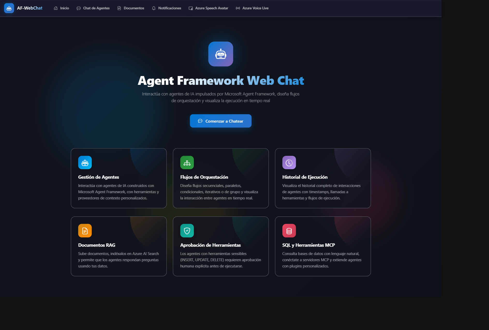
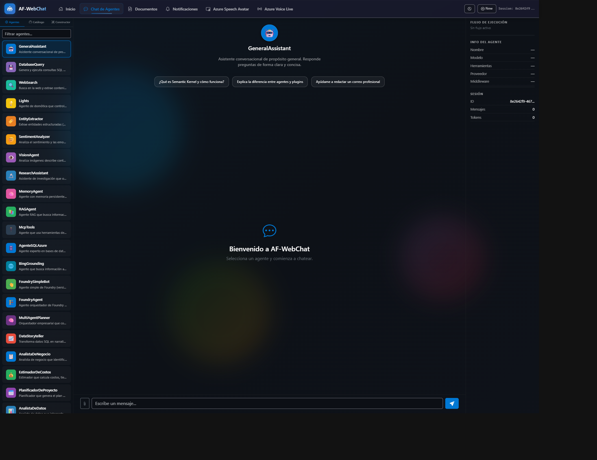
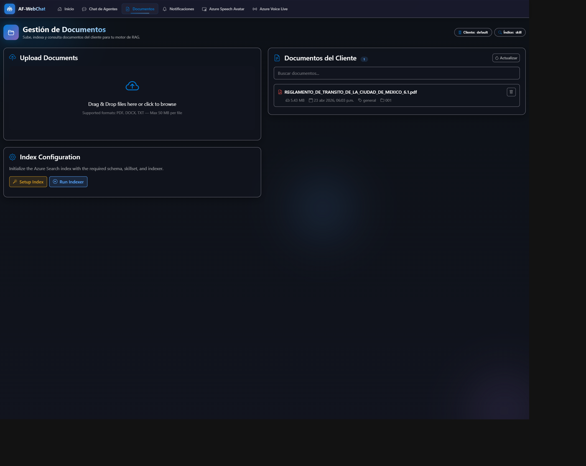
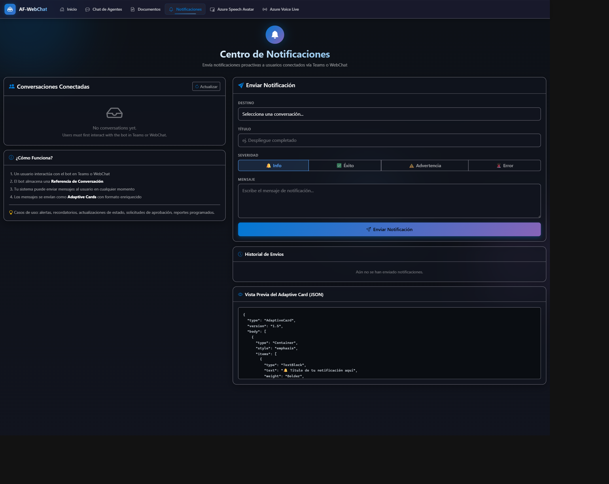
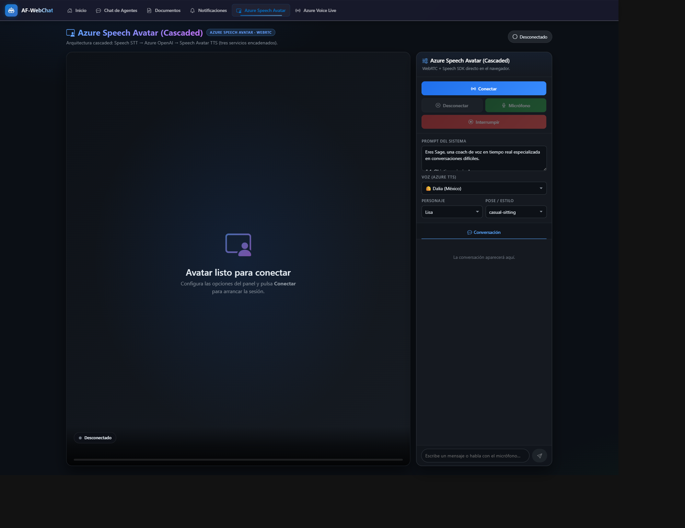
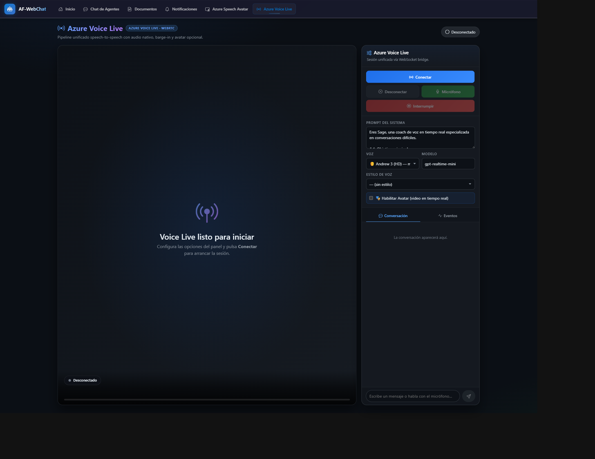

# SE-AgentFramework

**Plataforma de referencia para construir sistemas multi-agente con [Microsoft Agent Framework SDK](https://github.com/microsoft/agents) y Azure OpenAI.** Demuestra patrones de orquestación, workflows, integración con Microsoft Teams, Model Context Protocol (MCP), Azure AI Foundry, y más — todo en una solución .NET 9.

---

## ¿Qué es este proyecto?

SE-AgentFramework es una implementación completa y funcional que muestra cómo diseñar, orquestar y publicar agentes de IA usando el stack de Microsoft. No es un SDK ni una librería — es una **aplicación de referencia** que puedes clonar, explorar y adaptar a tus propios escenarios.

El objetivo es demostrar de forma práctica:

- Cómo crear agentes de IA con `Microsoft.Agents.AI` y conectarlos a Azure OpenAI
- Cómo orquestar múltiples agentes con patrones de la industria (Sequential, GroupChat, FanOut, Conditional, Iterative)
- Cómo publicar agentes en Microsoft Teams, Web, y Azure AI Foundry
- Cómo integrar herramientas externas vía plugins nativos y Model Context Protocol (MCP)
- Cómo implementar RAG con Azure AI Search, consultas SQL, Bing Grounding, y más
- Cómo diseñar una UI web con streaming SSE, theming dinámico y Adaptive Cards

---

## Estructura de la solución

```
SE-AgentFramework.sln
│
├── 02-AFWebChat/              ← Aplicación principal
│   ├── Agents/                   35+ agentes organizados por categoría
│   ├── Orchestrations/           Orquestación multi-agente (Sequential, GroupChat, GroupChatAI)
│   ├── Workflows/                Workflows (Iterative, Conditional, FanOut)
│   ├── Bot/                      Integración Bot Framework para Teams
│   ├── Controllers/              API REST (Chat, Agents, Sessions, Proactive)
│   ├── Services/                 ChatClientFactory, SessionService, Orchestration
│   ├── Tools/Plugins/            16 plugins (SQL, Search, MCP, Bing, Web Scraping...)
│   ├── Middleware/               Auditoría, Logging, Métricas
│   ├── Views/                    UI Razor (Chat, Documents, Notifications)
│   └── wwwroot/                  CSS, JS, assets del frontend
│
└── 01-AgentConsole/           ← (Reservado para demo de consola)
```

---

## Arquitectura de la solución

### Diagrama de arquitectura de alto nivel

```
┌─────────────────────────────────────────────────────────────────────────────────┐
│                              CLIENTES / CANALES                                 │
│                                                                                 │
│   ┌─────────────┐    ┌─────────────────┐    ┌──────────────┐    ┌───────────┐  │
│   │  Web Chat   │    │ Microsoft Teams │    │   REST API   │    │  Foundry  │  │
│   │  (Browser)  │    │  (Bot Framework)│    │  (HTTP/JSON) │    │  Agents   │  │
│   │  SSE Stream │    │ Adaptive Cards  │    │              │    │  Service  │  │
│   └──────┬──────┘    └───────┬─────────┘    └──────┬───────┘    └─────┬─────┘  │
│          │                   │                     │                  │         │
└──────────┼───────────────────┼─────────────────────┼──────────────────┼─────────┘
           │                   │                     │                  │
           ▼                   ▼                     ▼                  ▼
┌─────────────────────────────────────────────────────────────────────────────────┐
│              AF-WebChat (.NET 9 / ASP.NET Core — Azure App Service)             │
│                                                                                 │
│  ┌──────────────────────────────────────────────────────────────────────────┐   │
│  │                        CAPA DE ENTRADA (Controllers)                     │   │
│  │  ChatController │ HomeController │ DocumentController │ ProactiveCtrl    │   │
│  │  SessionController │ AgentWorkflowController │ TeamsBotAgent            │   │
│  └────────────────────────────────┬─────────────────────────────────────────┘   │
│                                   │                                             │
│  ┌──────────────────────────────────────────────────────────────────────────┐   │
│  │                     CAPA DE MIDDLEWARE (Cross-cutting)                    │   │
│  │  AuditMiddleware │ LoggingMiddleware │ MetricsMiddleware                  │   │
│  └────────────────────────────────┬─────────────────────────────────────────┘   │
│                                   │                                             │
│  ┌──────────────────────────────────────────────────────────────────────────┐   │
│  │                   CAPA DE ORQUESTACIÓN (Services)                        │   │
│  │                                                                          │   │
│  │  AgentOrchestrationService ── OrchestrationFactory ── WorkflowFactory    │   │
│  │        │                                                                 │   │
│  │        ├── Agente Individual (1:1 con ChatClient)                        │   │
│  │        ├── Sequential / Concurrent (multi-agente en cadena o paralelo)   │   │
│  │        ├── GroupChat Round-Robin / AI Moderator                          │   │
│  │        ├── Handoff (delegación dinámica)                                 │   │
│  │        └── Workflows: Iterative / Conditional / FanOut                   │   │
│  └────────────────────────────────┬─────────────────────────────────────────┘   │
│                                   │                                             │
│  ┌──────────────────────────────────────────────────────────────────────────┐   │
│  │                      CAPA DE AGENTES (Agent Registry)                    │   │
│  │                                                                          │   │
│  │  ┌──────────┐ ┌──────────┐ ┌───────────┐ ┌────────────┐ ┌────────────┐  │   │
│  │  │ Básicos  │ │  Tools   │ │  Dominio  │ │ Enterprise │ │ Structured │  │   │
│  │  │ 3 agents │ │ 6 agents │ │ 9 agents  │ │  2 agents  │ │  2 agents  │  │   │
│  │  └──────────┘ └──────────┘ └───────────┘ └────────────┘ └────────────┘  │   │
│  │  ┌──────────┐ ┌──────────┐ ┌───────────┐ ┌────────────┐                 │   │
│  │  │   MCP    │ │ Foundry  │ │ Multimodal│ │  Workflow  │                 │   │
│  │  │ 1 agent  │ │ 2 agents │ │  1 agent  │ │ 17 agents  │                 │   │
│  │  └──────────┘ └──────────┘ └───────────┘ └────────────┘                 │   │
│  └────────────────────────────────┬─────────────────────────────────────────┘   │
│                                   │                                             │
│  ┌──────────────────────────────────────────────────────────────────────────┐   │
│  │                     CAPA DE HERRAMIENTAS (Plugins)                        │   │
│  │                                                                          │   │
│  │  SqlPlugin │ AzureSearchPlugin │ BingGroundingPlugin │ McpServerPlugin   │   │
│  │  WebScrapingPlugin │ LegalIndexPlugin │ SkillIndexPlugin │ WeatherPlugin │   │
│  │  LightsPlugin │ FileManagerPlugin │ EmailDataPlugin │ OrderPlugins       │   │
│  └────────────────────────────────┬─────────────────────────────────────────┘   │
│                                   │                                             │
│  ┌──────────────────────────────────────────────────────────────────────────┐   │
│  │                   CAPA DE SERVICIOS INTERNOS                              │   │
│  │                                                                          │   │
│  │  ChatClientFactory │ SessionService │ DocumentService                    │   │
│  │  BlobStorageService │ DocumentIndexingService │ StreamEventService       │   │
│  └──────────────────────────────────────────────────────────────────────────┘   │
│                                                                                 │
└─────────────────────────────────────────────┬───────────────────────────────────┘
                                              │
                                              ▼
┌─────────────────────────────────────────────────────────────────────────────────┐
│                          SERVICIOS DE AZURE                                     │
│                                                                                 │
│  ┌────────────────┐  ┌──────────────────┐  ┌───────────────────────────────┐   │
│  │ ★ Azure App   │  │  Azure OpenAI    │  │  Azure AI Foundry             │   │
│  │  Service       │  │  (GPT-4o,        │  │  (Agentes versionados,        │   │
│  │  (HOST)        │  │   Embeddings)    │  │   Agent Service)              │   │
│  └────────────────┘  └──────────────────┘  └───────────────────────────────┘   │
│                                                                                 │
│  ┌────────────────┐  ┌──────────────────┐  ┌───────────────────────────────┐   │
│  │ Azure AI       │  │ Azure Blob       │  │  Azure Document Intelligence  │   │
│  │ Search (RAG,   │  │ Storage          │  │  (OCR, extracción de texto    │   │
│  │ Sem., Vectors) │  │ (Documentos)     │  │   de PDFs/imágenes)           │   │
│  └────────────────┘  └──────────────────┘  └───────────────────────────────┘   │
│                                                                                 │
│  ┌────────────────┐  ┌──────────────────┐  ┌───────────────────────────────┐   │
│  │ Azure Bot      │  │ Azure Cosmos DB  │  │  Microsoft Entra ID           │   │
│  │ Service        │  │ (Sesiones        │  │  (Autenticación)              │   │
│  │ (Teams)        │  │  persistentes)   │  │                               │   │
│  └────────────────┘  └──────────────────┘  └───────────────────────────────┘   │
│                                                                                 │
│  ┌───────────────────────────────────────────────────────────────────────────┐  │
│  │  ⚙️ Opcionales: Azure SQL Database · Bing Search API                     │  │
│  │    (solo si se habilitan los agentes SqlAzure / BingGrounding)            │  │
│  └───────────────────────────────────────────────────────────────────────────┘  │
│                                                                                 │
│  ┌───────────────────────────────────────────────────────────────────────────┐  │
│  │  🎙️ Opcionales (Voz y Avatar):                                           │  │
│  │    Azure Speech Service · Azure VoiceLive (gpt-4o-realtime)              │  │
│  │    (solo si se habilitan las páginas VoiceLive / LiveAvatar)              │  │
│  └───────────────────────────────────────────────────────────────────────────┘  │
│                                                                                 │
└─────────────────────────────────────────────────────────────────────────────────┘
```

### Flujo de una petición

```
Usuario ─► Canal (Web/Teams/API) ─► Controller ─► Middleware (Audit/Log/Metrics)
    │
    ▼
AgentOrchestrationService
    │
    ├── Agente Individual ──► ChatClientFactory ──► Azure OpenAI
    │
    ├── Orquestación (Sequential/GroupChat/Handoff)
    │       └── N agentes coordinados ──► Azure OpenAI
    │
    └── Workflow (Iterative/Conditional/FanOut)
            └── Agentes especializados ──► Azure OpenAI + Plugins
                                                │
                                                ├── SqlPlugin ──► Azure SQL Database
                                                ├── AzureSearchPlugin ──► Azure AI Search
                                                ├── BingGroundingPlugin ──► Bing Search API
                                                ├── McpServerPlugin ──► MCP Server externo
                                                └── DocumentService ──► Blob Storage + Doc Intelligence
```

1. El usuario envía un mensaje desde Web Chat, Teams o API REST
2. El `AgentOrchestrationService` determina el tipo de ejecución (individual, orquestación o workflow)
3. Cada agente usa `ChatClientFactory` para comunicarse con **Azure OpenAI**
4. Los agentes invocan **plugins** durante la ejecución para acceder a datos y servicios externos
5. La respuesta se retorna como stream SSE (web) o Adaptive Card (Teams)

---

## Servicios de Azure utilizados

### Servicios principales (requeridos)

| Servicio | SKU / Modelo | Propósito en la solución | Componentes que lo usan |
|---|---|---|---|
| **Azure App Service** | B1+ / P1v3 (producción) | Hospeda la aplicación web ASP.NET Core. Es el recurso principal de cómputo donde vive la solución | Toda la aplicación (AF-WebChat) |
| **Azure OpenAI** | `gpt-4o`, `text-embedding-3-large` | Motor de inferencia central para todos los agentes. Genera respuestas, ejecuta function calling, genera embeddings para RAG | `ChatClientFactory`, todos los agentes |
| **Microsoft Entra ID** | — | Autenticación y autorización. Soporta `DefaultAzureCredential` para acceso sin API keys | `Azure.Identity`, Bot Framework, todos los servicios Azure |

### Servicios opcionales (habilitan funcionalidades avanzadas)

| Servicio | Propósito en la solución | Componentes que lo usan | Configuración |
|---|---|---|---|
| **Azure AI Search** | Retrieval Augmented Generation (RAG) con búsqueda semántica, vectorial e híbrida sobre documentos indexados | `AzureSearchPlugin`, `AzureSearchRAGProvider`, `DocumentIndexingService`, `LegalIndexPlugin`, `SkillIndexPlugin` | `AzureSearch:Endpoint`, `AzureSearch:IndexName` |
| **Azure SQL Database** ⚙️ | Consultas a bases de datos empresariales. Los agentes pueden explorar esquemas y ejecutar queries SELECT de solo lectura. **No se requiere si no se usan los agentes de SQL** | `SqlPlugin`, `GetSchemaPlugin`, `QuerySqlPlugin`, `EmailDataPlugin` | `ConnectionStrings:SqlServer` |
| **Azure Blob Storage** | Almacenamiento de documentos subidos por usuarios. Sirve como data source para el indexador de Azure AI Search | `BlobStorageService`, `DocumentService` | `AzureStorage:AccountName`, `BlobStorage:ConnectionString` |
| **Azure Document Intelligence** | OCR y extracción inteligente de texto de PDFs, imágenes y documentos escaneados | `DocumentService` | `AzureDocumentIntelligence:Endpoint` |
| **Azure AI Foundry** | Publicación de agentes como servicios versionados con RBAC, trazabilidad y gestión del ciclo de vida | `FoundrySimpleBotAgent`, `FoundryOrchestratorAgent` | `AzureOpenAI:EndpointProject` |
| **Azure Cosmos DB** | Persistencia duradera de sesiones de conversación (alternativa al almacenamiento en memoria) | `SessionService` (configuración opcional) | `CosmosDB:ConnectionString`, `CosmosDB:DatabaseName` |
| **Azure Bot Service** | Canal de comunicación con Microsoft Teams. Gestiona el registro del bot, autenticación y enrutamiento de mensajes | `TeamsBotAgent`, `ConversationReferenceStore` | `Connections:ServiceConnection`, `TokenValidation` |
| **Bing Search API** ⚙️ | Grounding con búsqueda web en tiempo real. Permite a los agentes acceder a información actualizada de internet. **No se requiere si no se usa el agente BingGrounding** | `BingGroundingPlugin` | `BingSearch:ApiKey` |
| **Azure Speech Service** 🎙️ | Síntesis de voz neural y reconocimiento de voz. Usado por la página LiveAvatar para generar audio+animación del avatar en tiempo real (AvatarSynthesizer) y transcribir al usuario (SpeechRecognizer). **No se requiere si no se usa la página LiveAvatar** | `LiveAvatarController`, `live-avatar.js` | `AzureSpeech:SubscriptionKey`, `AzureSpeech:Region` |
| **Azure VoiceLive** 🎙️ | Conversaciones de voz en tiempo real con modelos GPT-4o Realtime. Soporta tres modos: Full Native S2S (voces OpenAI), Cascade (voces neurales Azure) e Hybrid (voces HD Azure). Opcionalmente renderiza un avatar animado vía WebRTC. **No se requiere si no se usa la página VoiceLive** | `VoiceLiveController`, `voice-live.js` | `VoiceLive:Endpoint`, `VoiceLive:ApiKey`, `VoiceLive:Model` |

> ⚙️ = Completamente opcional. La aplicación funciona sin este servicio; solo se necesita si se habilitan los agentes que lo consumen.
>
> 🎙️ = Funcionalidad de voz y avatar opcional. No se requiere ninguna infraestructura adicional si no se usan las páginas VoiceLive/LiveAvatar. Los recursos de Azure Speech y los deployments de modelos realtime solo son necesarios si se activan estas funcionalidades.

### Diagrama de recursos Azure

```
                        ┌──────────────────────┐
                        │   Azure Subscription  │
                        └──────────┬───────────┘
                                   │
                    ┌──────────────┼──────────────┐
                    │              │              │
                    ▼              ▼              ▼
          ┌─────────────┐ ┌─────────────┐ ┌─────────────┐
          │ Resource     │ │ Microsoft   │ │ Azure Bot   │
          │ Group        │ │ Entra ID    │ │ Service     │
          │ (af-webchat) │ │ (Tenant)    │ │ (Teams)     │
          └──────┬──────┘ └─────────────┘ └─────────────┘
                 │
                 ▼
        ┌────────────────┐
        │ ★ Azure App    │
        │   Service      │   ◄── Recurso principal (HOST)
        │   (Web App)    │
        └───────┬────────┘
                │
    ┌───────────┼───────────┬────────────┬────────────┐
    │           │           │            │            │
    ▼           ▼           ▼            ▼            ▼
┌────────┐ ┌────────┐ ┌──────────┐ ┌──────────┐ ┌──────────┐
│ Azure  │ │ Azure  │ │ Azure    │ │ Azure    │ │ Azure    │
│ OpenAI │ │ AI     │ │ SQL DB   │ │ Blob     │ │ Cosmos   │
│        │ │ Search │ │ (opt)    │ │ Storage  │ │ DB       │
│ gpt-4o │ │ (RAG)  │ │          │ │ (Docs)   │ │(Sessions)│
│ embed  │ │ Vector │ │          │ │          │ │          │
└────────┘ └────────┘ └──────────┘ └──────────┘ └──────────┘
    │            │
    │            │
    ▼            ▼
┌────────┐ ┌──────────┐ ┌───────────┐
│ Azure  │ │ Azure    │ │ Bing      │
│ AI     │ │ Document │ │ Search    │
│Foundry │ │ Intel.   │ │ API (opt) │
│(Agents)│ │ (OCR)    │ │           │
└────────┘ └──────────┘ └───────────┘

┌────────────────────────────────────────────┐
│ 🎙️ Voz y Avatar (opcionales)              │
│                                            │
│ ┌──────────┐  ┌─────────────────────────┐  │
│ │ Azure    │  │ Azure VoiceLive         │  │
│ │ Speech   │  │ (gpt-4o-realtime        │  │
│ │ Service  │  │  + avatar WebRTC)       │  │
│ │(LiveAvat)│  │                         │  │
│ └──────────┘  └─────────────────────────┘  │
│                                            │
│  Solo si se usan las páginas               │
│  VoiceLive / LiveAvatar                    │
└────────────────────────────────────────────┘
                              ▲
                         (opcional)

★ = Azure App Service es el recurso principal donde vive la aplicación
```

### Autenticación y seguridad

La solución soporta dos modos de autenticación hacia los servicios de Azure:

| Modo | Configuración | Recomendación |
|---|---|---|
| **DefaultAzureCredential** | No se configura `ApiKey` — se usa `az login` o Managed Identity | ✅ Recomendado para producción |
| **API Key** | Se configura `ApiKey` en `appsettings.Development.json` | Solo para desarrollo local rápido |

La autenticación con Bot Framework (Teams) usa **Microsoft Entra ID** con `ClientId`, `ClientSecret` y `TenantId` configurados en la sección `Connections`.

---

## Vistazo a la interfaz

La aplicación incluye seis páginas principales, todas con un sistema de theming unificado vía `--app-*` tokens (un solo cambio en `appsettings.json → AppBranding` recolorea toda la UI).

### Home — Landing page

Hero con gradiente del color de acento del cliente + 6 feature cards con glassmorphism y animación de entrada escalonada.



### Chat de Agentes

Selector de agentes, streaming SSE en tiempo real, soporte de markdown y syntax highlight para código.



### Documentos (RAG)

Drag & drop con metadata (Expediente, Documento, Tipo), subida a Azure Blob Storage, indexación en Azure AI Search y administración del índice. Iconos coloreados por tipo de archivo (PDF / Word / TXT).



### Centro de Notificaciones

Envía notificaciones proactivas (Adaptive Cards) a usuarios conectados en Teams o WebChat. Severidad coloreada por chip e historial con barra lateral por nivel.



### Azure Speech Avatar (Cascaded)

Pipeline cascaded: Speech STT → Azure OpenAI → Speech Avatar TTS. Soporta Full body (3D) y Talking Heads (vasa-1). Render del avatar vía WebRTC.



### Azure Voice Live

Speech-to-speech unificado con `gpt-realtime-mini` (Whisper-1 para transcripción del usuario). Avatar opcional, barge-in, catálogo de voces (S2S OpenAI, Azure HD, multilingüe, español) y centro de eventos en vivo.



---

## Capacidades principales

### Agentes de IA (35+)

| Categoría | Agentes | Descripción |
|---|---|---|
| **Básico** | GeneralAssistant, Translator, Summarizer | Conversación general, traducción, resúmenes |
| **Herramientas** | DatabaseQuery, WebSearch, Lights, Weather, FileManager | Agentes con tool-calling (function calling) |
| **Dominio** | SqlAzure, LegalAdvisor, CodeReviewer, BingGrounding, AzureSearch | Especializados con conocimiento de dominio |
| **Empresarial** | MultiAgentPlanner, DataStoryteller | Orquestadores que combinan SQL + RAG + Web |
| **Structured Output** | EntityExtractor, SentimentAnalyzer | Salida JSON estructurada |
| **Multimodal** | Vision | Análisis de imágenes con GPT-4o |
| **Composite** | ResearchAssistant | Investigación multi-paso |
| **MCP** | McpTools | Herramientas vía Model Context Protocol |
| **Foundry** | FoundrySimpleBot, FoundryOrchestrator | Agentes publicados en Azure AI Foundry |
| **Approval** | DataModifier | Agente con aprobación humana antes de ejecutar |
| **Workflow** | 17 agentes especializados | Colaboran en orquestaciones de negocio |

### Patrones de orquestación

| Patrón | Tipo | Descripción |
|---|---|---|
| **Sequential** | Orchestration | Agentes se ejecutan uno tras otro, pasándose el contexto |
| **Concurrent** | Orchestration | Agentes se ejecutan en paralelo |
| **GroupChat (Round-Robin)** | Orchestration | Agentes discuten por turnos como en una junta |
| **GroupChat (AI Moderator)** | Orchestration | Un LLM decide quién habla según el contexto |
| **Handoff** | Orchestration | Un agente delega a otro dinámicamente |
| **Iterative** | Workflow | Writer↔Reviewer loop hasta aprobación |
| **Conditional (Switch)** | Workflow | Clasificador IA enruta al agente correcto |
| **FanOut** | Workflow | Ejecución paralela + síntesis |

### Canales de publicación

| Canal | Tecnología | Características |
|---|---|---|
| **Web Chat** | ASP.NET + SSE | Streaming en tiempo real, theming, markdown |
| **Microsoft Teams** | Bot Framework + Adaptive Cards | Cards interactivas, notificaciones proactivas |
| **Azure AI Foundry** | `Azure.AI.Projects` SDK | Agentes versionados con RBAC y trazabilidad |
| **REST API** | HTTP endpoints | Integración con cualquier cliente |
| **VoiceLive** 🎙️ | Azure VoiceLive + WebSocket + WebRTC | Conversación de voz en tiempo real con GPT-4o Realtime. Tres modos: Full Native S2S, Cascade, Hybrid. Avatar animado opcional vía WebRTC |
| **LiveAvatar** 🎙️ | Azure Speech SDK + WebRTC | Avatar parlante con síntesis neural. Reconocimiento de voz en navegador + AvatarSynthesizer. Siempre en modo Cascade |

> 🎙️ = Canales de voz opcionales. Requieren Azure Speech Service y/o modelos GPT-4o Realtime. No afectan el funcionamiento de los demás canales.

### 🎙️ Voz en tiempo real (opcional)

La aplicación incluye **dos páginas de conversación de voz** que son **completamente opcionales**. Tanto las funcionalidades como la infraestructura de Azure que requieren solo son necesarias si se desea habilitar estas experiencias.

#### Páginas disponibles

| Página | Controlador | Script | Descripción |
|---|---|---|---|
| **VoiceLive** | `VoiceLiveController` | `voice-live.js` | Conversación de voz bidireccional con GPT-4o Realtime vía WebSocket. Audio PCM16 a 24kHz. Avatar animado opcional vía WebRTC |
| **LiveAvatar** | `LiveAvatarController` | `live-avatar.js` | Avatar parlante con Azure Speech SDK en navegador. `SpeechRecognizer` (STT) + `AvatarSynthesizer` (TTS + animación). Siempre modo Cascade |

#### Modos de procesamiento de voz (VoiceLive)

| Modo | Voces | Flujo | Descripción |
|---|---|---|---|
| **Full Native S2S** | `alloy`, `coral`, `shimmer`, etc. | Audio → GPT-4o → Audio | El modelo procesa audio nativamente sin STT/TTS externo. Latencia más baja |
| **Cascade** | `es-MX-DaliaNeural`, etc. | Audio → STT → LLM → TTS → Audio | Pipeline completo Speech-to-Text → LLM → Text-to-Speech. Voces neurales de Azure |
| **Hybrid** | `DragonHDLatestNeural`, etc. | Audio nativo → LLM → TTS HD → Audio | Input nativo del modelo, salida con voces HD de Azure. Mejor calidad de voz |

#### Infraestructura requerida (solo si se usan)

| Recurso | Para qué | Configuración |
|---|---|---|
| **Azure Speech Service** | STT/TTS para LiveAvatar; voces Cascade/Hybrid en VoiceLive | `AzureSpeech:SubscriptionKey`, `AzureSpeech:Region` |
| **Deployment GPT-4o Realtime** | Modelo realtime para VoiceLive | `VoiceLive:Endpoint`, `VoiceLive:ApiKey`, `VoiceLive:Model` |
| **GPU de avatar** (Azure) | Renderizado del avatar animado en la nube | Incluido en Azure Speech (avatar feature) |

> **Nota:** Si no se configuran las claves `AzureSpeech:SubscriptionKey` y `VoiceLive:ApiKey`, las páginas de voz simplemente no estarán disponibles. El resto de la aplicación (Web Chat, Teams, API, agentes) funciona con normalidad sin estos servicios.

---

## Requisitos

| Componente | Mínimo | Notas |
|---|---|---|
| **.NET SDK** | 9.0+ | |
| **Azure OpenAI** | Deployment `gpt-4o` | Endpoint + API Key o `DefaultAzureCredential` |
| **Node.js** | 18+ | Solo si usas MCP Server |
| **Azure Bot** | | Solo si publicas en Teams |

### Servicios opcionales

| Servicio | Para qué |
|---|---|
| Azure AI Search | RAG (Retrieval Augmented Generation) |
| Azure SQL Database | Agentes de consulta SQL |
| Azure Blob Storage | Subir y procesar documentos |
| Azure Document Intelligence | OCR y extracción de documentos |
| Bing Search API | Grounding con búsqueda web |
| Azure AI Foundry | Publicar agentes como servicio |
| Azure Cosmos DB | Persistencia de sesiones (opcional) |
| Azure Speech Service 🎙️ | Voz y avatar para LiveAvatar (STT + TTS + avatar animado) |
| Azure VoiceLive 🎙️ | Conversación de voz en tiempo real con GPT-4o Realtime (página VoiceLive) |

---

## Inicio rápido

### 1. Clonar el repositorio

```bash
git clone https://github.com/JordanReyesLeger/agent-framework-web-chat.git
cd agent-framework-web-chat
```

### 2. Configurar secretos

Crea `02-AFWebChat/appsettings.Development.json` (ya está en `.gitignore`):

```json
{
  "AzureOpenAI": {
    "Endpoint": "https://tu-recurso.openai.azure.com/",
    "ApiKey": "tu-api-key",
    "ChatDeployment": "gpt-4o",
    "EmbeddingDeployment": "text-embedding-3-large"
  }
}
```

> Si no proporcionas `ApiKey`, se usará `DefaultAzureCredential` (requiere `az login`).

### 3. Ejecutar

```bash
cd 02-AFWebChat
dotnet run
```

Abre `https://localhost:5001/Home/Chat` en tu navegador.

---

## Stack tecnológico

| Tecnología | Versión | Propósito |
|---|---|---|
| **Microsoft 365 Agents SDK** | 1.4.83 | Hosting de Bot Framework |
| **Microsoft.Agents.AI** | 1.0.0-rc5 | Runtime de agentes IA |
| **Microsoft.Agents.AI.Workflows** | 1.0.0-rc5 | GroupChat, WorkflowBuilder |
| **Microsoft.Agents.AI.Foundry** | 1.1.0 | Integración Azure AI Foundry |
| **Azure.AI.OpenAI** | 2.9.0 | SDK de Azure OpenAI |
| **Azure.AI.Projects** | 2.0.0 | Foundry Agent Service |
| **Azure.Search.Documents** | 11.8.0 | Azure AI Search (RAG) |
| **Azure.Identity** | 1.20.0 | DefaultAzureCredential |
| **ModelContextProtocol** | 1.0.0 | MCP client para tools externos |
| **Azure.AI.VoiceLive** 🎙️ | 1.1.0-beta.3 | Conversaciones de voz en tiempo real con GPT-4o Realtime (opcional) |
| **Microsoft.CognitiveServices.Speech** 🎙️ | — | Azure Speech SDK para LiveAvatar: SpeechRecognizer + AvatarSynthesizer (opcional) |
| **AdaptiveCards** | 3.1.0 | UI rica en Teams |
| **.NET** | 9.0 | Runtime |
| **Bootstrap** | 5.3 | UI web |

---

## Configuración de secretos

El proyecto usa el patrón estándar de ASP.NET Core para separar configuración sensible:

| Archivo | Se sube al repo | Propósito |
|---|---|---|
| `appsettings.json` | ✅ Sí | Estructura base, valores por defecto (sin secretos) |
| `appsettings.Development.json` | ❌ No | Tus valores reales (API keys, connection strings) |

ASP.NET Core carga `appsettings.json` primero y luego sobreescribe con `appsettings.Development.json` cuando `ASPNETCORE_ENVIRONMENT=Development`. No necesitas cambiar nada en código.

---

## Documentación adicional

| Documento | Descripción |
|---|---|
| [02-AFWebChat/README.md](02-AFWebChat/README.md) | Documentación detallada del proyecto principal |
| [02-AFWebChat/THEMING.md](02-AFWebChat/THEMING.md) | Guía de personalización visual y branding |
| [02-AFWebChat/docs/TEAMS_INTEGRATION_GUIDE.md](02-AFWebChat/docs/TEAMS_INTEGRATION_GUIDE.md) | Guía paso a paso para publicar en Teams |

---

## Licencia

Este proyecto es una implementación de referencia con fines educativos y de demostración.
