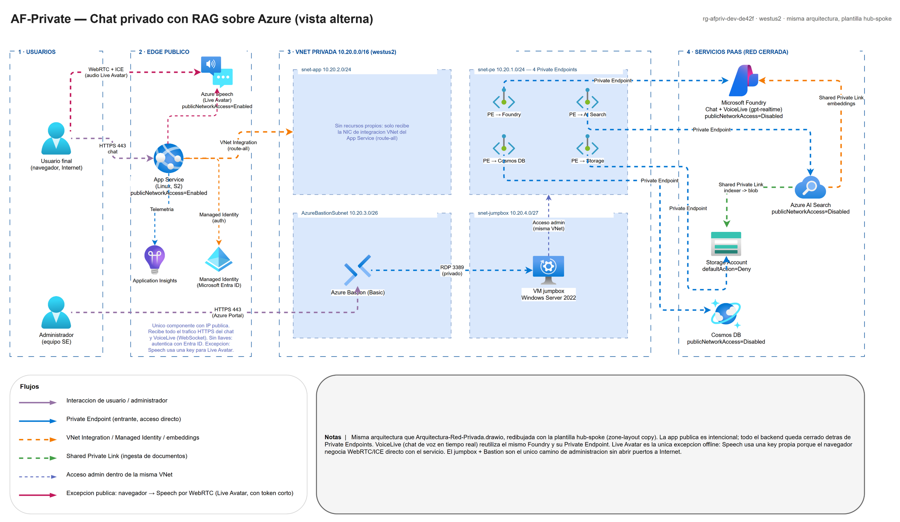
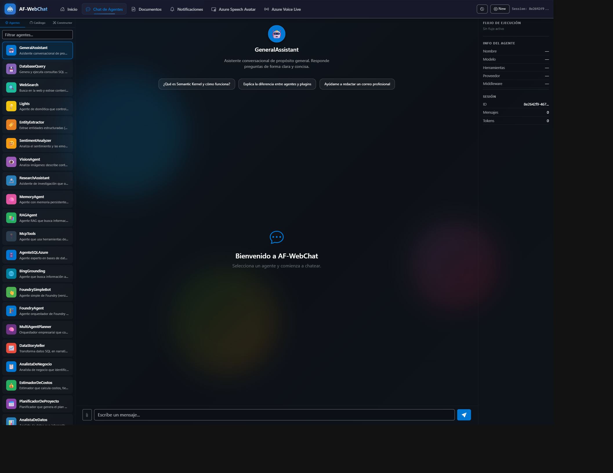
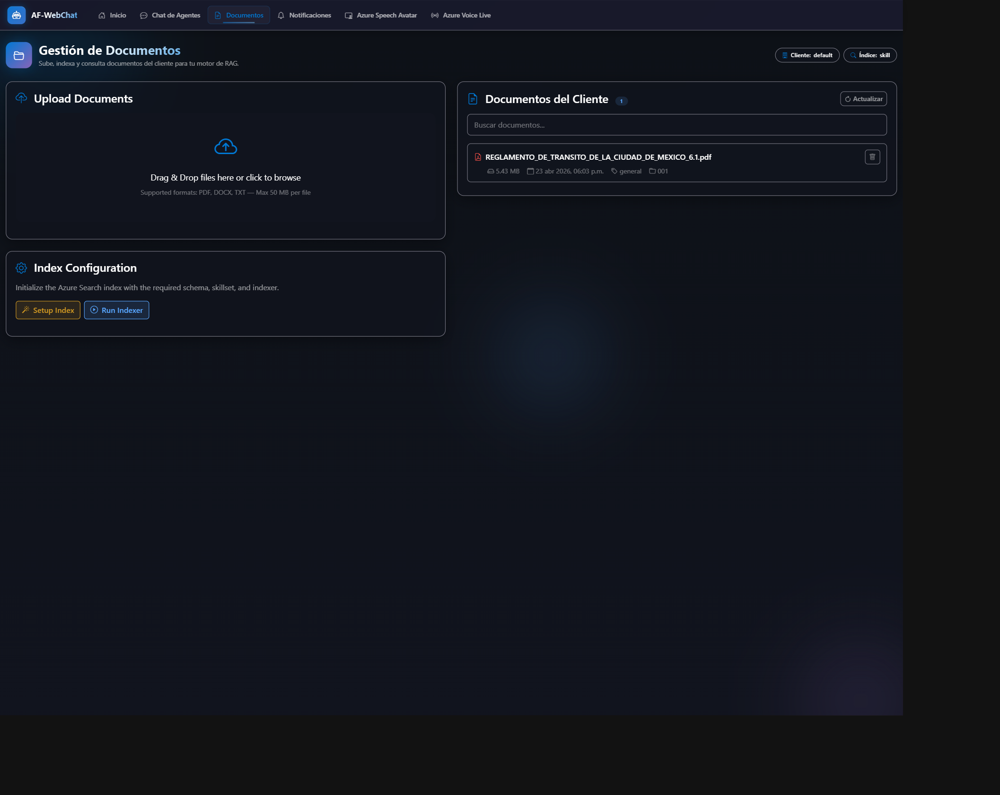
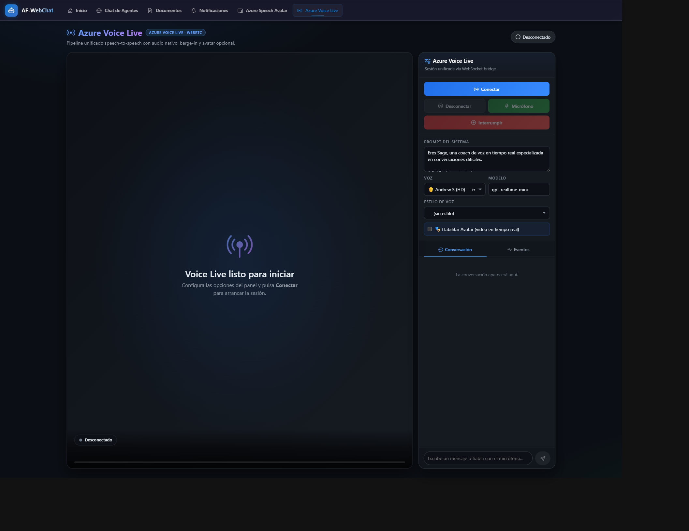
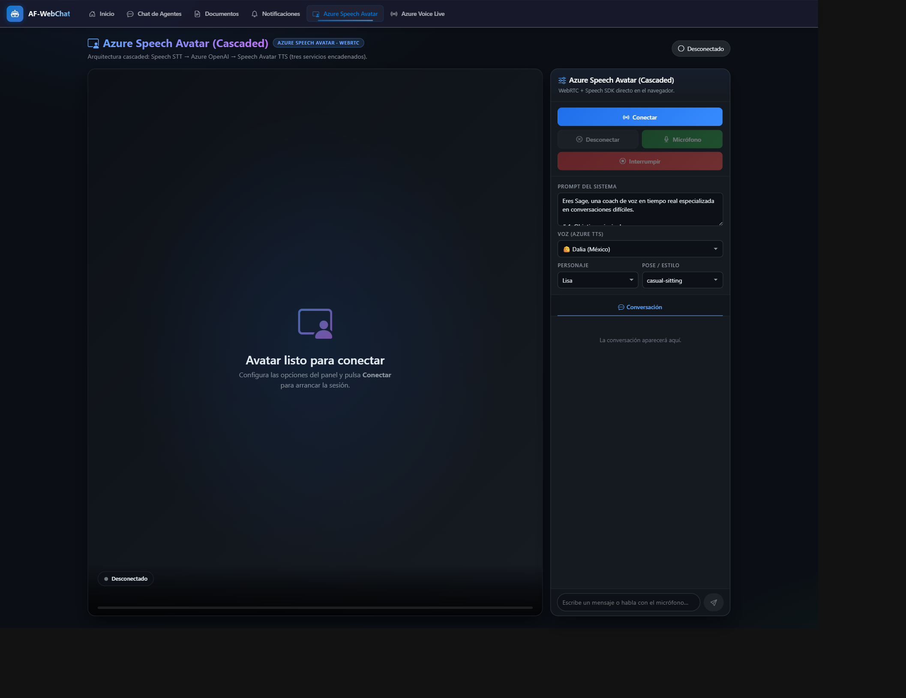

# AF-Private Environment

**Ambiente privado de referencia para Microsoft Foundry sobre Azure.** Muestra cómo ejecutar una aplicación multi-agente con RAG donde **todo el backend de IA y datos queda cerrado a Internet** y solo se alcanza por Private Endpoints dentro de una VNet.

El foco de este repositorio **no** es la aplicación, sino la **red**: cómo dejar Foundry, Azure AI Search, Cosmos DB y Storage con `publicNetworkAccess = Disabled` y que la solución siga funcionando de punta a punta.

---

## Arquitectura de red



> Diagrama editable: [docs/Arquitectura-Red-Privada-v2.drawio](docs/Arquitectura-Red-Privada-v2.drawio) (ábrelo con draw.io o [app.diagrams.net](https://app.diagrams.net))

### Las cuatro zonas

| Zona | Qué vive ahí | Exposición |
|---|---|---|
| **1 · Usuarios** | Usuario final (navegador) y administrador (equipo de operación) | Internet |
| **2 · Edge público** | App Service (Linux), Application Insights, Managed Identity, Azure Speech | **Única superficie pública** |
| **3 · VNet privada** `10.20.0.0/16` | 4 subredes: `snet-app`, `snet-pe`, `AzureBastionSubnet`, `snet-jumpbox` | Privada |
| **4 · Servicios PaaS** | Foundry, AI Search, Cosmos DB, Storage | **Cerrados a Internet** |

### El principio de diseño

> La app es pública **a propósito** — el criterio de éxito es que el chat responda desde Internet.
> Todo lo demás (modelos, índices, sesiones, documentos) queda cerrado.

Esto significa que la superficie de ataque se reduce a **un solo recurso** (el App Service), y ese recurso autentica contra todo el backend con **Managed Identity, sin llaves**.

---

## Cómo funciona el ambiente privado

### 1. La app sale por la VNet, no por Internet

El App Service usa **VNet Integration** sobre la subred `snet-app`, que está delegada a `Microsoft.Web/serverFarms`:

```hcl
virtual_network_subnet_id = azurerm_subnet.app.id
# ...
vnet_route_all_enabled = true
```

`vnet_route_all_enabled = true` es la pieza clave: **todo** el tráfico saliente de la app se enruta por la VNet, no solo el de rangos privados. Sin esto, la app seguiría resolviendo e intentando llegar a los endpoints públicos de Foundry y Search — que están cerrados — y el síntoma sería un timeout sin mensaje útil.

La subred `snet-app` **no tiene recursos propios**: solo recibe la NIC de integración que Azure inyecta.

### 2. Los cuatro Private Endpoints

En `snet-pe` (`10.20.1.0/24`) viven cuatro Private Endpoints, uno por servicio:

| Private Endpoint | Servicio destino | Subresource |
|---|---|---|
| `pe-...-foundry` | Microsoft Foundry (`AIServices`) | `account` |
| `pe-...-search` | Azure AI Search | `searchService` |
| `pe-...-cosmos` | Cosmos DB | `Sql` *(case-sensitive)* |
| `pe-...-blob` | Storage Account | `blob` |

La subred tiene `private_endpoint_network_policies = "Disabled"`, requisito para poder colocar PEs en ella.

### 3. Las zonas DNS privadas (el paso que más se olvida)

Un Private Endpoint sin zona DNS privada **existe pero nadie lo resuelve**. El nombre público sigue apuntando a la IP pública, y como esa está cerrada, el resultado es un timeout silencioso.

Por eso se crean y **vinculan a la VNet** estas zonas:

| Zona DNS privada | Para |
|---|---|
| `privatelink.cognitiveservices.azure.com` | Foundry |
| `privatelink.openai.azure.com` | Foundry |
| `privatelink.services.ai.azure.com` | Foundry |
| `privatelink.blob.core.windows.net` | Storage |
| `privatelink.search.windows.net` | AI Search |
| `privatelink.documents.azure.com` | Cosmos DB |

> **Por qué Foundry necesita tres zonas:** un recurso `kind = AIServices` publica **tres FQDN distintos**. Hay que resolver los tres, porque según por cuál entre el SDK, falla si falta alguno. Es el error más común al cerrar Foundry.

Cada zona lleva su `azurerm_private_dns_zone_virtual_network_link` con `registration_enabled = false`.

### 4. Shared Private Links: el indexer de AI Search

Aquí está la sutileza que rompe el RAG y no da error visible.

**El indexer de Azure AI Search no corre dentro de tu VNet.** Sale desde el runtime del servicio de Search. Cuando Storage y Foundry se cierran a Internet, el indexer deja de poder alcanzarlos — y el síntoma es que los documentos se quedan "indexando para siempre" sin ningún error en la app.

La única vía es un **Shared Private Link** por cada destino:

| Shared Private Link | Destino | Subresource | Para qué |
|---|---|---|---|
| `spl-blob` | Storage Account | `blob` | Que el indexer lea los documentos |
| `spl-openai` | Foundry | `openai_account` | Skill de embeddings |
| `spl-cognitive` | Foundry | `cognitiveservices_account` | Skills de OCR / merge (facturación keyless) |

> ⚠️ **Quedan en estado `Pending`.** Terraform los crea, pero hay que **aprobarlos manualmente** en el recurso destino (Portal → recurso → Networking → Private endpoint connections). Hasta que se aprueben, la ingesta de documentos no funciona.

### 5. Administración: Bastion + jumpbox

Con Foundry, Search, Cosmos y Storage cerrados, **no puedes administrarlos desde tu laptop**. El camino es:

```
Admin ──HTTPS 443──► Azure Bastion ──RDP 3389 (privado)──► VM jumpbox ──► Private Endpoints
     (Azure Portal)   AzureBastionSubnet                    snet-jumpbox      snet-pe
```

- **Azure Bastion** (SKU `Basic`) vive en `AzureBastionSubnet` — el nombre es **obligatorio y literal**, mínimo `/26`.
- La **VM jumpbox** (Windows Server 2022) **no tiene IP pública** y no expone 3389 a Internet. Bastion conecta por el plano de datos de Azure hacia su IP privada.
- El NSG de Bastion necesita reglas específicas (`AllowGatewayManagerInbound`, `AllowLoadBalancerInbound`, puertos `8080`/`5701`). Sin ellas el host se aprovisiona pero la sesión **nunca conecta**.

### 6. La excepción del Storage

El Storage **no** queda con `publicNetworkAccess = Disabled`, sino con `default_action = "Deny"` más una excepción de IP:

```hcl
network_rules {
  default_action = "Deny"
  bypass         = ["AzureServices"]
  ip_rules       = var.admin_ip_address == "" ? [] : [var.admin_ip_address]
}
```

**Por qué:** Terraform crea los contenedores por el **plano de datos**, que no pasa por el Private Endpoint si Terraform corre fuera de la VNet. Esa `admin_ip_address` es la puerta de administración: se abre para desplegar y **se cierra después**. El tráfico de la app siempre entra por el Private Endpoint.

### 7. Voz: VoiceLive vs Live Avatar

Son dos cosas distintas en términos de red:

| Experiencia | Cómo viaja | Red |
|---|---|---|
| **VoiceLive** (voz en tiempo real) | Navegador → WebSocket → App Service → Foundry | ✅ Privada — reutiliza el mismo Foundry y su Private Endpoint |
| **Live Avatar** (avatar parlante) | Navegador → **WebRTC/ICE directo** → Azure Speech | ⚠️ **Única excepción pública** |

Live Avatar requiere que el **navegador negocie WebRTC directamente** con el servicio de Speech — no puede pasar por el App Service ni por la VNet. Por eso Azure Speech es el único recurso que mantiene `publicNetworkAccess = Enabled` y **una API key**: el backend la usa para emitir un **token de corta vida** que el navegador consume. La key nunca se expone al cliente.

---

## Postura de seguridad

| Recurso | Acceso público | Auth local (llaves) | Cómo entra la app |
|---|---|---|---|
| **Microsoft Foundry** | ❌ Disabled | ❌ Disabled | Private Endpoint + Managed Identity |
| **Azure AI Search** | ❌ Disabled | ❌ Disabled | Private Endpoint + Managed Identity |
| **Cosmos DB** | ❌ Disabled | ❌ Disabled | Private Endpoint + RBAC de datos |
| **Storage Account** | ⚠️ `Deny` + IP admin | ❌ `shared_access_key_enabled = false` | Private Endpoint + Managed Identity |
| **App Service** | ✅ Enabled *(intencional)* | — | — |
| **Azure Speech** | ✅ Enabled *(excepción)* | ⚠️ Key para token de Live Avatar | — |

**Cero llaves, salvo una excepción documentada.** Toda la autenticación es con `DefaultAzureCredential` sobre Managed Identity.

> **Nota sobre Cosmos DB:** tiene su **propio RBAC de plano de datos**, separado del RBAC de ARM. Un rol de ARM *no alcanza* — se necesita un `azurerm_cosmosdb_sql_role_assignment` explícito.

---

## Mapa de red

| Recurso | Rango / Nombre | Notas |
|---|---|---|
| **VNet** | `10.20.0.0/16` | `vnet_address_space` |
| `snet-pe` | `10.20.1.0/24` | Private Endpoints · `network_policies = Disabled` |
| `snet-app` | `10.20.2.0/24` | Delegada a `Microsoft.Web/serverFarms` · sin recursos propios |
| `AzureBastionSubnet` | `10.20.3.0/26` | Nombre literal obligatorio · mínimo `/26` |
| `snet-jumpbox` | `10.20.4.0/27` | NIC del jumpbox · sin IP pública |

Todos los rangos son variables en [infra/variables_network.tf](infra/variables_network.tf) — nada está hardcodeado.

---

## Despliegue

### Pre-requisitos

| Componente | Notas |
|---|---|
| **Azure CLI** | `az login` con la suscripción destino |
| **Terraform** | `>= 1.5` |
| **PowerShell 7** | Para inyectar la key de Speech (Live Avatar) |
| **.NET SDK 9** | Para `dotnet publish` |

### 1. Configurar variables

```pwsh
cd infra
Copy-Item terraform.tfvars.sample terraform.tfvars
```

Rellena al menos:

```hcl
subscription_id  = "<tu-subscription-id>"
admin_ip_address = "<tu-ip-publica>"   # para que Terraform pueda crear los contenedores
```

> **Región:** el App Service va en **`westus2`**. En `eastus2` varias suscripciones reportan cuota 0 para todos los SKU de App Service.

### 2. Provisionar

```pwsh
terraform init
terraform apply -auto-approve
```

### 3. Aprobar los Shared Private Links

**Este paso es manual y obligatorio** — sin él, la ingesta de documentos no funciona:

1. Portal → **Storage Account** → Networking → *Private endpoint connections* → aprobar `spl-blob`
2. Portal → **Foundry** → Networking → *Private endpoint connections* → aprobar `spl-openai` y `spl-cognitive`

### 4. Desplegar el código

```pwsh
cd ..\02-AFWebChat
dotnet publish AF-WebChat.csproj -c Release -o publish
Compress-Archive -Path publish\* -DestinationPath publish.zip -Force

$rg  = (terraform -chdir=..\infra output -raw resource_group_name)
$app = (terraform -chdir=..\infra output -raw web_app_name)

az resource update -g $rg -n scm `
  --namespace Microsoft.Web --resource-type basicPublishingCredentialsPolicies `
  --parent "sites/$app" --set properties.allow=true --api-version 2023-12-01

az webapp stop  -n $app -g $rg
Start-Sleep -Seconds 15
az webapp deploy -n $app -g $rg --src-path publish.zip --type zip
az webapp start -n $app -g $rg
```

> **¿Por qué `stop` + `deploy` + `start`?** El primer `az webapp deploy` sobre un Linux Web App recién creado a veces devuelve HTTP 400 aunque el deployment sí continúe. Parar el sitio antes es el truco que funciona consistentemente.

### 5. Cerrar la puerta de administración

Una vez creados los contenedores, quita la excepción de IP en `terraform.tfvars`:

```hcl
admin_ip_address = ""
```

```pwsh
terraform apply -auto-approve
```

A partir de aquí, el Storage solo se alcanza por Private Endpoint o desde el jumpbox.

### 6. Verificar

Desde el **jumpbox** (vía Bastion), confirma que los nombres resuelven a IPs privadas:

```powershell
nslookup aif-<sufijo>.openai.azure.com
nslookup srch-<sufijo>.search.windows.net
nslookup cosmos-<sufijo>.documents.azure.com
nslookup st<sufijo>.blob.core.windows.net
```

Todos deben devolver direcciones dentro de `10.20.1.0/24`. Si alguno devuelve una IP pública, falta el vínculo de la zona DNS privada a la VNet.

---

## Troubleshooting de red

| Síntoma | Causa probable | Fix |
|---|---|---|
| La app da timeout sin mensaje útil al llamar a Foundry | Falta zona DNS privada, o falta el vínculo a la VNet | Verifica las **tres** zonas de Foundry y sus `virtual_network_link` |
| Funciona un endpoint de Foundry pero otro no | Solo se creó una de las tres zonas DNS | Crea las tres: `cognitiveservices`, `openai`, `services.ai` |
| Los documentos se indexan "para siempre" sin error | Shared Private Links en `Pending` | Apruébalos en Storage y en Foundry |
| La app llega a Internet pero no a los PEs | Falta `vnet_route_all_enabled = true` | Actívalo en la config del App Service |
| Terraform falla creando contenedores de Storage | Plano de datos bloqueado | Define `admin_ip_address` con tu IP pública |
| El Bastion se crea pero la sesión nunca conecta | Faltan reglas del NSG | Revisa `AllowGatewayManagerInbound` y `AllowLoadBalancerInbound` |
| Cosmos rechaza a la app aun con rol de ARM | Cosmos usa RBAC de datos aparte | Agrega `azurerm_cosmosdb_sql_role_assignment` |
| El sitio responde 403 "Unavailable" tras `terraform apply` | El Web App quedó `Stopped` | `az webapp show --query state` y luego `az webapp start` |

---

## Estructura del repositorio

```
af-private-environment/
│
├── infra/                       ← Infraestructura como código (Terraform)
│   ├── network.tf                  VNet, subredes, DNS privado, PEs, Shared Private Links
│   ├── jumpbox.tf                  Bastion + VM de administración + NSG
│   ├── variables_network.tf        Rangos de red parametrizados
│   ├── foundry.tf                  Cuenta AIServices + proyecto + modelos
│   ├── search.tf                   AI Search (keyless, privado)
│   ├── cosmosdb.tf                 Cosmos DB (keyless, privado)
│   ├── storage.tf                  Storage (Deny + excepción de IP admin)
│   ├── appservice.tf               Web App + VNet Integration
│   ├── speech.tf                   Azure Speech (excepción pública)
│   ├── voicelive.tf                Modelos realtime sobre el mismo Foundry
│   ├── identity.tf                 UAMI y asignaciones de rol
│   └── post_deploy_keys.tf         Inyección de la key de Speech
│
├── 02-AFWebChat/                ← Aplicación .NET 9 (ASP.NET Core)
│   ├── Agents/                     Agentes organizados por categoría
│   ├── Orchestrations/             Sequential, Concurrent, GroupChat, Handoff
│   ├── Workflows/                  Iterative, Conditional, FanOut
│   ├── Controllers/                API REST + streaming SSE
│   ├── Services/                   ChatClientFactory, SessionService, RAG
│   └── wwwroot/                    Frontend
│
└── docs/
    ├── Arquitectura-Red-Privada-v2.drawio
    └── Arquitectura-Red-Privada-v2.png
```

---

## La aplicación (contexto)

El ambiente hospeda **AF-WebChat**, una app multi-agente construida con [Microsoft Agent Framework](https://github.com/microsoft/agents) (`Microsoft.Agents.AI`, .NET 9) sobre Microsoft Foundry. Sirve para validar que la red privada funciona de punta a punta con carga real.

| Capacidad | Qué ejercita de la red |
|---|---|
| Chat con agentes (streaming SSE) | App Service → PE de Foundry |
| RAG sobre documentos | Storage + indexer de Search vía Shared Private Links |
| Persistencia de sesiones | PE de Cosmos DB + RBAC de datos |
| Orquestaciones y workflows multi-agente | Múltiples llamadas concurrentes por el PE de Foundry |
| VoiceLive | WebSocket sostenido → PE de Foundry |
| Live Avatar | WebRTC directo a Speech (la excepción pública) |

### Vistazo a la interfaz

| Chat de agentes (streaming SSE) | Documentos (RAG) |
|---|---|
|  |  |

| Voice Live (por el PE de Foundry) | Live Avatar (excepción pública) |
|---|---|
|  |  |

---

## Configuración y secretos

| Archivo | Se sube al repo | Contenido |
|---|---|---|
| `appsettings.json` | ✅ Sí | Estructura base con valores vacíos o placeholders |
| `appsettings.Development.json` | ❌ No | Endpoints locales (está en `.gitignore`) |
| `infra/terraform.tfvars.sample` | ✅ Sí | Plantilla con valores de ejemplo |
| `infra/terraform.tfvars` | ❌ No | Tu `subscription_id` real |
| `infra/terraform.tfstate` | ❌ No | **Contiene claves en texto plano** — nunca se commitea |
| `infra/tfplan*` | ❌ No | Planes de Terraform |

Todo lo sensible está parametrizado y cubierto por `.gitignore`. En Azure, la app no guarda llaves: usa Managed Identity.

---

## Licencia

Implementación de referencia con fines educativos y de demostración. Ver [LICENSE.txt](LICENSE.txt).
